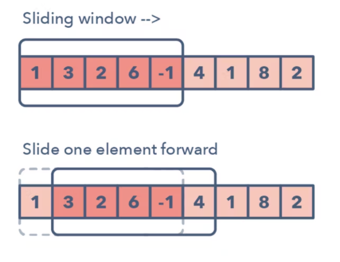

# 04-4. 슬라이딩 윈도우

- 2개의 포인터로 범위를 지정한 다음 범위(window)를 유지한 채로 이동(sliding)하며 문제를 해결
- 길이가 P인 윈도우를 지정하여 배열의 시작점에 놓는다. 그 후 윈도우를 오른쪽으로 밀면서 윈도우에 잡힌 값들이 조건에 맞는지 탐색한다.
- 배열의 길이만큼만 탐색을 진행하면 되므로 O(n)의 시간 복잡도로 문제를 해결할 수 있다.

 

### 예제 문제

- [문제 009. DNA 비밀번호](./문제009.%20DNA%20비밀번호.md)
- [문제 010. 최솟값 찾기](./문제010.%20최솟값%20찾기.md)
