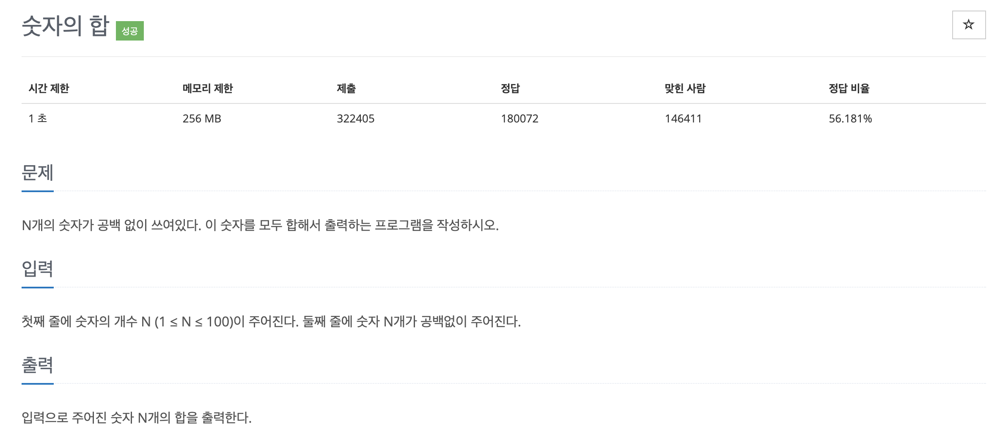

# 문제 001. 숫자의 합 구하기



### 내가 작성한 풀이

```java
메모리 17768KB, 시간 184ms

public class P11720_숫자의합구하기 {

	public static void main(String[] args) {
		Scanner sc = new Scanner(System.in);
		int N = sc.nextInt();

		int sum = 0;
		String[] inputNum = sc.next().split("");
		for(int n=0; n<N; n++) {
			sum += Integer.parseInt(inputNum[n]);
		}

		System.out.println(sum);
	}
}

```

### 문제집 풀이

```java
메모리 17716KB, 시간 176ms

public class P11720_숫자의합구하기 {

    public static void main(String[] args) {
        Scanner sc = new Scanner(System.in);
        int N = sc.nextInt();

        // 입력값을 String형 변수 sNum에 저장한 후 char[]형 변수로 변환
        String sNum = sc.next();
        char[] cNum = sNum.toCharArray();

        int sum = 0;
        for(int i=0; i<cNum.length; i++) {
            sum += cNum[i] - '0';	// cNum[i]를 정수형으로 변환하면서 sum에 더하여 누적
        }

        System.out.println(sum);
    }
}

```

<br />

### 자바에서의 형 변환

#### String형 → 숫자형(int, double, float, long, short)

- `int i1 = Integer.parseInt(sNum)`
- `int i2 = Integer.valueOf(sNum)`
- `double d1 = Double.parseDouble(sNum)`
- `double d2 = Double.valueOf(sNum)`
- `float f1 = Float.parseFloat(sNum)`
- `float f2 = Float.valueOf(sNum)`
- `long l1 = Long.parseLong(sNum)`
- `long l2 = Long.valueOf(sNum)`
- `short s1 = Short.parseShort(sNum)`
- `short s2 = Short.valueOf(sNum)`

#### 숫자형(int, double, float, long, short) → String형

- `String i1 = String.valueOf(i);`
- `String i2 = Integer.toString(i);`
- `String d1 = String.valueOf(d)`
- `String d2 = Double.toString(d)`
- `String f1 = String.valueOf(f)`
- `String f2 = Float.toString(f)`
- `String l1 = String.valueOf(l)`
- `String l2 = Long.toString(l)`
- `String s1 = String.valueOf(s)`
- `String s2 = Short.toString(s)`
