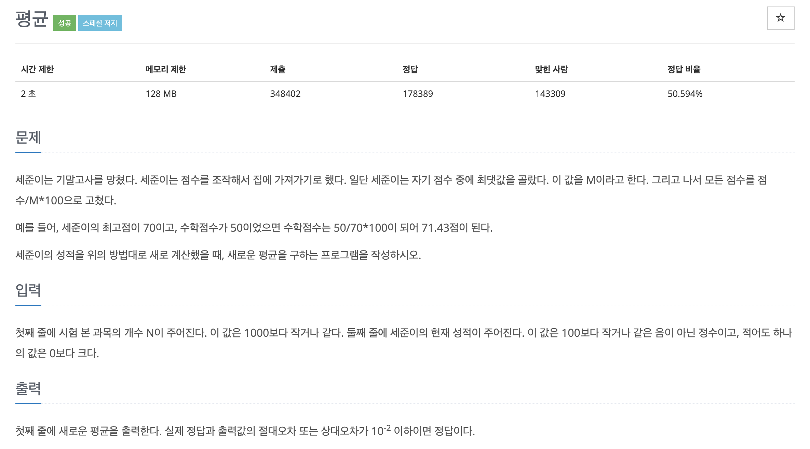

# 문제002. 평균 구하기



### 내가 작성한 풀이

```java
메모리 19096KB, 시간 208ms

public class P1546_평균 {

	public static void main(String[] args) {
		Scanner sc = new Scanner(System.in);
		int N = sc.nextInt();	            // 시험 본 과목의 개수
		double[] score = new double [N];	// 각 과목의 현재 성적을 저장할 배열
		double max = 0;	                    // 점수 최댓값

		// 점수 입력받고, 최댓값 갱신
		for(int i=0; i<N; i++) {
			score[i] = sc.nextInt();
			max = (score[i] > max) ? score[i] : max;
		}

		// 모든 점수를 점수/M*100으로 변경
		double sum = 0;
		for(int i=0; i<N; i++) {
			sum += score[i] / max * 100;
		}

		// 평균 계산
		double avg = sum / N;
		System.out.println(avg);
	}
}
```

### 문제집 풀이

```java
메모리 18704KB, 시간 208ms

public class P1546_평균 {

	public static void main(String[] args) {
		Scanner sc = new Scanner(System.in);
		int N = sc.nextInt();		// 시험 본 과목의 개수
		int[] score = new int [N];	// 각 과목의 현재 성적을 저장할 배열
		for(int i=0; i<N; i++) {
			score[i] = sc.nextInt();
		}

		long sum = 0;
		long max = 0;
		for(int i=0; i<N; i++) {
			max = (score[i] > max) ? score[i] : max;
			sum += score[i];
		}

		// (A/M*100 + B/M*100 + C/M*100) / 3 = (A+B+C) / M * 100 / 3
		System.out.println(sum * 100.0 / max / N);
	}
}

```
