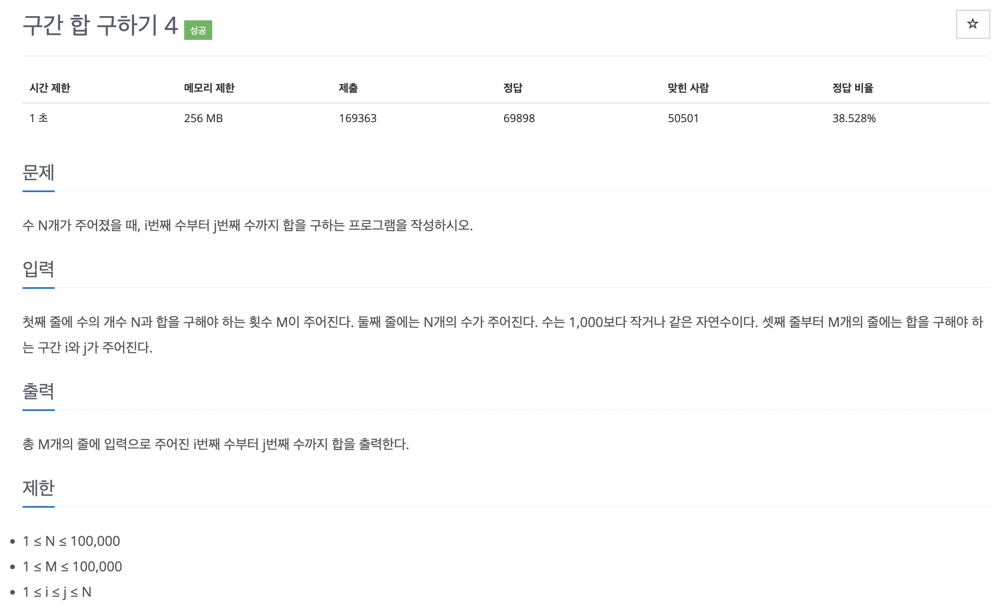

# 문제 003. 구간 합 구하기



### 내가 작성한 풀이

```java
메모리 257540KB, 시간 1804ms

public class P11659_구간합구하기 {

	public static void main(String[] args) {
		Scanner sc = new Scanner(System.in);
		int N = sc.nextInt();	// 수의 개수
		int M = sc.nextInt();	// 합을 구해야 하는 횟수

		int[] nums = new int [N+1];		// 입력받은 수를 저장한 배열
		int[] sumArr = new int [N+1];	// 누적합을 저장한 배열
		for(int i=1; i<=N; i++) {
			nums[i] = sc.nextInt();
			sumArr[i] = sumArr[i-1] + nums[i];
		}

		for(int i=0; i<M; i++) {
			int start = sc.nextInt();
			int end = sc.nextInt();

			System.out.println(sumArr[end] - sumArr[start-1]);
		}
	}
}
```

### 문제집 풀이

```java
메모리 59188KB, 시간 1156ms

public class P11659_구간합구하기 {

	public static void main(String[] args) throws IOException {
		BufferedReader br = new BufferedReader(new InputStreamReader(System.in));
		StringTokenizer st = new StringTokenizer(br.readLine());

		int N = Integer.parseInt(st.nextToken());	// 수의 개수
		int M = Integer.parseInt(st.nextToken());	// 합을 구해야 하는 횟수

		long[] sumArr = new long [N+1];		// 누적합을 저장한 배열
		st = new StringTokenizer(br.readLine());
		for(int i=1; i<=N; i++) {
			sumArr[i] = sumArr[i-1] + Integer.parseInt(st.nextToken());
		}

		for(int i=0; i<M; i++) {
			st = new StringTokenizer(br.readLine());
			int start = Integer.parseInt(st.nextToken());
			int end = Integer.parseInt(st.nextToken());

			System.out.println(sumArr[end] - sumArr[start-1]);
		}
	}
}

```
