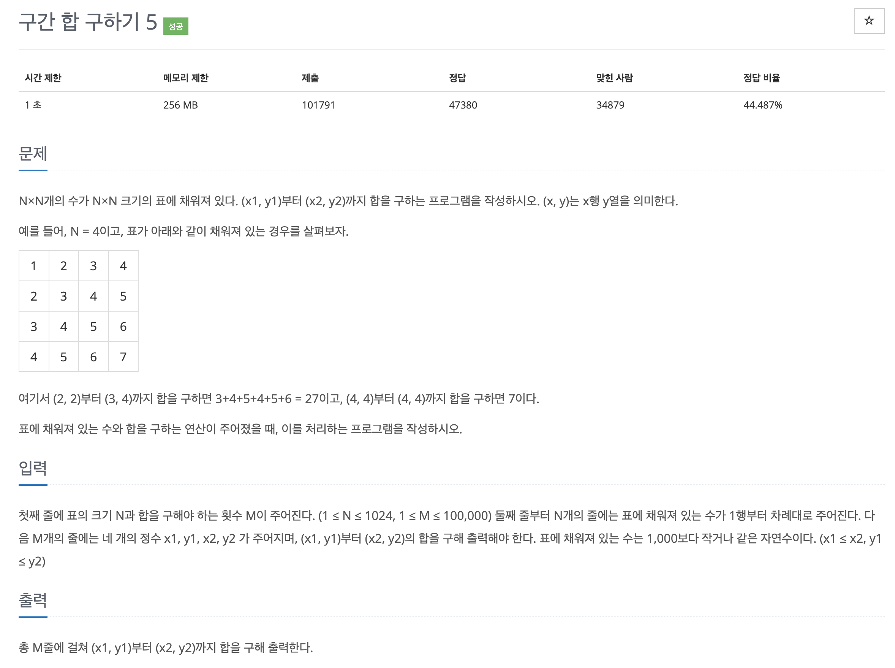

# 문제 004. 구간 합 구하기2



### 내가 작성한 풀이

```java
메모리 128732KB, 시간 1924ms

public class P11660_구간합구하기2 {

	public static void main(String[] args) throws IOException {
		BufferedReader br = new BufferedReader(new InputStreamReader(System.in));
		StringTokenizer st = new StringTokenizer(br.readLine());

		int N = Integer.parseInt(st.nextToken());	// 표의 크기
		int M = Integer.parseInt(st.nextToken());	// 합을 구해야 하는 횟수

		long[][] arr = new long [N+1][N+1];
		for(int r=1; r<=N; r++) {
			st = new StringTokenizer(br.readLine());
			for(int c=1; c<=N; c++) {
				arr[r][c] = arr[r][c-1] + Integer.parseInt(st.nextToken());
			}
		}

		for(int i=0; i<M; i++) {
			st = new StringTokenizer(br.readLine());
			int x1 = Integer.parseInt(st.nextToken());
			int y1 = Integer.parseInt(st.nextToken());
			int x2 = Integer.parseInt(st.nextToken());
			int y2 = Integer.parseInt(st.nextToken());

			int answer = 0;
			for(int x=x1; x<=x2; x++) {
				answer += (arr[x][y2] - arr[x][y1-1]);
			}
			System.out.println(answer);
		}
	}
}
```

### 문제집 풀이

```java
메모리 129172KB, 시간 1340ms

public class P11660_구간합구하기2 {

	public static void main(String[] args) throws IOException {
		BufferedReader br = new BufferedReader(new InputStreamReader(System.in));
		StringTokenizer st = new StringTokenizer(br.readLine());

		int N = Integer.parseInt(st.nextToken());	// 표의 크기
		int M = Integer.parseInt(st.nextToken());	// 합을 구해야 하는 횟수

		int[][] A = new int [N+1][N+1];		// 입력받은 표의 값 저장
		for(int r=1; r<=N; r++) {
			st = new StringTokenizer(br.readLine());
			for(int c=1; c<=N; c++) {
				A[r][c] = Integer.parseInt(st.nextToken());
			}
		}

		int[][] D = new int [N+1][N+1];		// 계산한 구간 합 저장
		for(int r=1; r<=N; r++) {
			for(int c=1; c<=N; c++) {
				D[r][c] = D[r][c-1] + D[r-1][c] - D[r-1][c-1] + A[r][c];
			}
		}

		for(int i=0; i<M; i++) {
			st = new StringTokenizer(br.readLine());
			int x1 = Integer.parseInt(st.nextToken());
			int y1 = Integer.parseInt(st.nextToken());
			int x2 = Integer.parseInt(st.nextToken());
			int y2 = Integer.parseInt(st.nextToken());

			int answer = D[x2][y2] - D[x1-1][y2] - D[x2][y1-1] + D[x1-1][y1-1];
			System.out.println(answer);
		}
	}
}
```
