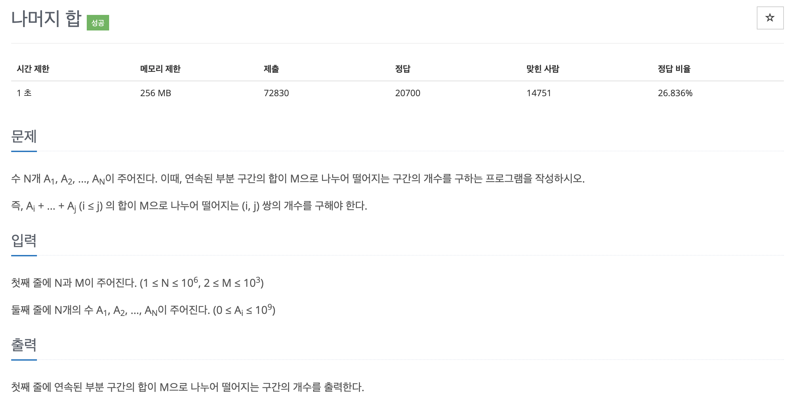

# 문제 005. 나머지 합 구하기



### 필요한 아이디어

- `(A+B)%C` 는 `((A%C)+(B%C)) % C` 와 같다. 다시 말해 특정 구간 수들의 나머지 연산을 더해 나머지 연산을 한 값과 이 구간 합에 나머지 연산을 한 값은 동일하다.

- `S[j] % M` 의 값과 `S[i] % M` 의 값이 같다면 `(S[j]-S[i]) % M` 은 0이다. 즉, 구간 합 배열의 원소를 M으로 나눈 나머지로 업데이트하고 S[j]와 S[i]가 같은 (i, j) 쌍을 찾으면 원본 배열에서 i+1 부터 j까지의 구간 합이 M으로 나누어 떨어진다는 것을 알 수 있다.

### 문제집 풀이

```java
메모리 328216KB, 시간 1612ms

public class P10986_나머지합 {

	public static void main(String[] args) {
		Scanner sc = new Scanner(System.in);
		int N = sc.nextInt();	// N개의 수
		int M = sc.nextInt();	// 구간의 합이 M으로 나누어 떨어지는 구간의 개수

		long[] S = new long [N+1];	// 누적합
		long[] C = new long [M];	// 나머지 값 인덱스
		long answer = 0;

		for(int i=1; i<=N; i++) {
			S[i] = S[i-1] + sc.nextInt();
		}

		// 합 배열의 모든 값에 % 연산 수행
		for(int i=1; i<=N; i++) {
			int remainder = (int) (S[i] % M);

			// 0 ~ i 까지의 구간 합 자체가 0일 때 정답에 더하기
			if(remainder == 0) {
				answer++;
			}

			// 나머지가 같은 인덱스의 개수 카운팅
			C[remainder]++;
		}

		// 나머지가 같은 인덱스 중 2개를 뽑는 경우의 수 더하기
		for(int i=0; i<M; i++) {
			if(C[i] > 1) {
				answer = answer + (C[i] * (C[i]-1) / 2);
			}
		}

		System.out.println(answer);
	}
}
```
