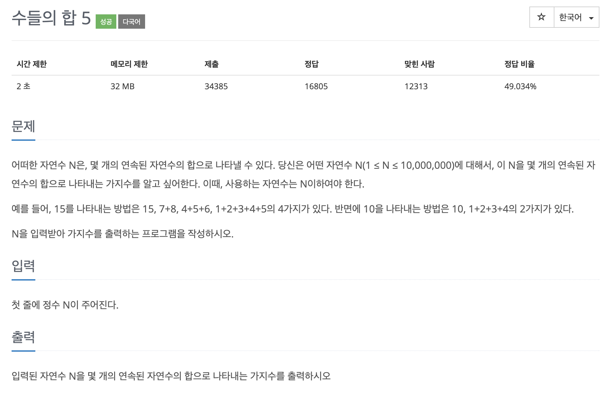

# 문제 006. 연속된 자연수의 합 구하기



### 내가 작성한 풀이

```java
메모리 17720KB, 시간 204ms

public class P2018_연속된자연수의합 {

	public static void main(String[] args) {
		Scanner sc = new Scanner(System.in);
		int N = sc.nextInt();	// 연속된 자연수의 합이 N이 되어야 함
		int answer = 0;			// 위의 조건을 만족하는 가지수

		int start = 1;		// 연속된 자연수 시작 포인트
		int end = 1;		// 연속된 자연수 종료 포인트
		int sum = 1;		// 연속된 자연수 합

		while (end <= N) {
			if(sum == N) {
				answer++;
			}

			// sum이 N보다 작다면 end 값을 키우면서 계속 진행
			if(sum < N) {
				end += 1;
				sum += end;
			} else {
				// sum이 N보다 크거나 같다면 시작점을 다시 설정
				sum -= start;
				start += 1;
			}
		}

		System.out.println(answer);
	}
}
```

### 문제집 풀이

```java
메모리 17768KB, 시간 208ms

public class P2018_연속된자연수의합 {

	public static void main(String[] args) {
		Scanner sc = new Scanner(System.in);
		int N = sc.nextInt();
		int count = 1;
		int start_index = 1;
		int end_index = 1;
		int sum = 1;

		while (end_index != N) {
			if(sum == N) {				// 현재 연속 합이 N과 같은 경우
				count++;
				end_index++;
				sum = sum + end_index;
			} else if (sum > N) {		// 현재 연속 합이 N보다 더 큰 경우
				sum = sum - start_index;
				start_index++;
			} else {					// 현재 연속 합이 N보다 작은 경우
				end_index++;
				sum = sum + end_index;
			}
		}

		System.out.println(count);
	}
}
```
