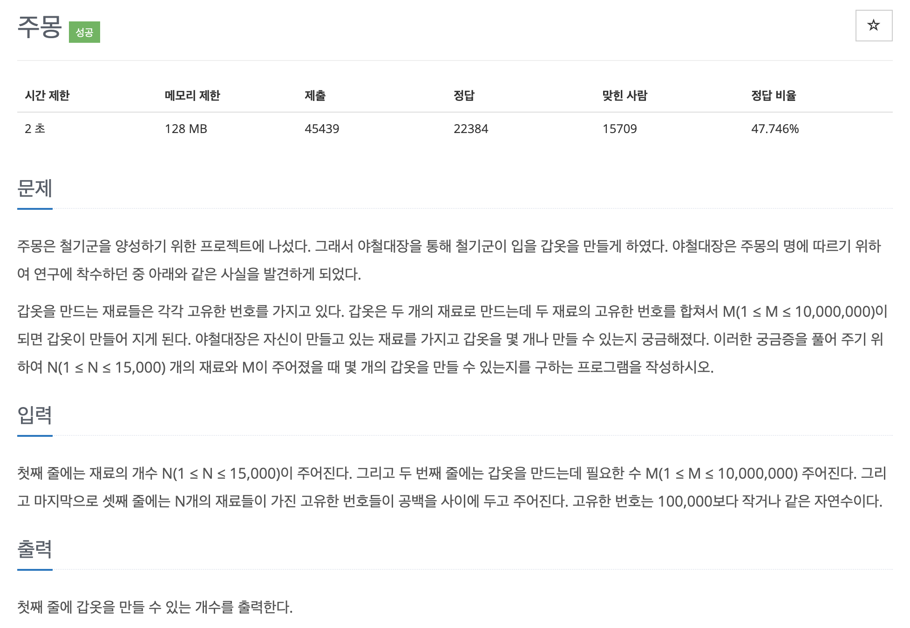

# 문제 007. 주몽의 명령



### 내가 작성한 풀이

```java
메모리 35416KB, 시간 412ms

public class P1940_주몽 {

	public static void main(String[] args) {
		Scanner sc = new Scanner(System.in);
		int N = sc.nextInt();		// 자료의 개수
		int M = sc.nextInt();		// 갑옷을 만드는데 필요한 수

		int[] nums = new int [N];	// 재료들이 가진 고유한 번호를 저장한 배열
		for(int i=0; i<N; i++) {
			nums[i] = sc.nextInt();
		}
		Arrays.sort(nums);

		int answer = 0;
		int leftIdx = 0;
		int rightIdx = N-1;

		while(leftIdx < rightIdx) {
			int sum = nums[leftIdx]+nums[rightIdx];
			if(sum == M) {
				answer++;
			}

			if(sum < M) {
				leftIdx++;
			} else {
				rightIdx--;
			}
		}

		System.out.println(answer);
	}
}
```

### 문제집 풀이

```java
메모리 16464KB, 시간 168ms

public class P1940_주몽 {

	public static void main(String[] args) throws IOException {
		BufferedReader br = new BufferedReader(new InputStreamReader(System.in));
		int N = Integer.parseInt(br.readLine());
		int M = Integer.parseInt(br.readLine());

		int[] A = new int [N];
		StringTokenizer st = new StringTokenizer(br.readLine());
		for(int i=0; i<N; i++) {
			A[i] = Integer.parseInt(st.nextToken());
		}
		Arrays.sort(A);

		int count = 0;
		int i = 0;
		int j = N-1;

		while(i < j) {
			if(A[i] + A[j] < M) {
				i++;
			} else if (A[i] + A[j] > M) {
				j--;
			} else {
				count++;
				i++;
				j--;
			}
		}

		System.out.println(count);
		br.close();
	}
}
```
