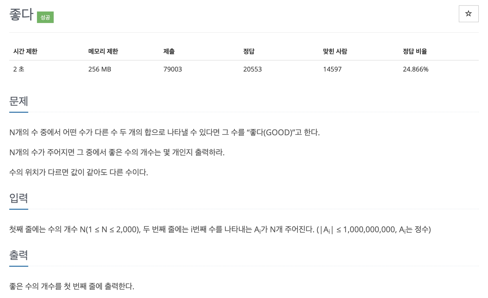

# 문제 008. '좋은 수' 구하기



### 내가 작성한 풀이

```java
메모리 22240KB, 시간 324ms

public class P1253_좋은수 {

	public static void main(String[] args) {

		Scanner sc = new Scanner(System.in);

		int n = sc.nextInt();
		int[] arr = new int [n];

		for(int i=0; i<n; i++) {
			arr[i] = sc.nextInt();
		}

		Arrays.sort(arr);	// 오름차순 정렬

		int answer = 0;

		// arr[i]가 다른 수 두 개의 합으로 나타낼 수 있는지 확인
		for(int i=0; i<n; i++) {
			int left = 0;
			int right = n-1;

			while(left < right) {
				// 자기 자신이 포함되는 경우 제외
				if (i == left) {
					left++;
					continue;
				} else if (i == right) {
					right--;
					continue;
				}

				int sum = arr[left] + arr[right];

				if (sum == arr[i]) {
					answer++;
					break;
				} else if (sum < arr[i]) {
					left++;
				} else {
					right--;
				}

			}
		}

		System.out.println(answer);

		sc.close();

	}

}
```

### 문제집 풀이

```java
메모리 16544KB, 시간 160ms

public class P1253_좋은수 {

	public static void main(String[] args) throws IOException {
		BufferedReader br = new BufferedReader(new InputStreamReader(System.in));
		int N = Integer.parseInt(br.readLine());
		int result = 0;

		long[] A = new long [N];
		StringTokenizer st = new StringTokenizer(br.readLine());
		for(int i=0; i<N; i++)  {
			A[i] = Long.parseLong(st.nextToken());
		}
		Arrays.sort(A);

		for(int k=0; k<N; k++) {
			long find = A[k];
			int i = 0;
			int j = N-1;

			// 투 포인터 알고리즘
			while(i < j) {
				if(A[i] + A[j] == find) {
					// find가 서로 다른 두 수의 합인지 체크하기
					if(i != k && j != k) {
						result++;
						break;
					} else if (i == k) {
						i++;
					} else if (j == k) {
						j--;
					}
				} else if (A[i] + A[j] < find) {
					i++;
				} else {
					j--;
				}
			}
		}

		System.out.println(result);
		br.close();
	}
}
```
