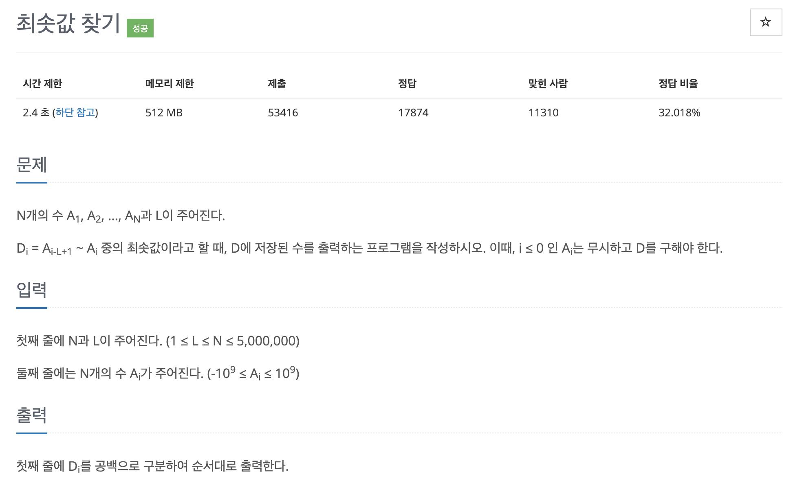

# 문제 010. 최솟값 찾기



### 필요한 아이디어

- 윈도우의 크기는 문제에서 최솟값을 구하는 범위가 `i-L+1` 부터 i까지이므로 L로 생각
- 일반적인 정렬은 $O(nlogn)$ 의 시간 복잡도를 가지므로 N과 L의 최대 범위가 5,000,000인 해당 문제에서는 정렬을 사용할 수 없다.  
   → 해당 문제는 $O(n)$ 의 시간 복잡도로 해결해야 한다.
- 이때 슬라이딩 윈도우를 덱(deque)으로 구현하여 정렬 효과를 볼 수 있다.

### 문제집 풀이

```java
메모리 619640KB, 시간 2348ms

public class P11003_최솟값찾기 {

	static class Node {
		int value;
		int index;

		Node(int value, int index) {
			this.value = value;
			this.index = index;
		}
	}

	public static void main(String[] args) throws IOException {
		BufferedReader br = new BufferedReader(new InputStreamReader(System.in));
		// 출력을 버퍼에 넣고 한 번에 출력하기 위해 BufferedWriter 사용
		BufferedWriter bw = new BufferedWriter(new OutputStreamWriter(System.out));
		StringTokenizer st = new StringTokenizer(br.readLine());
		int N = Integer.parseInt(st.nextToken());
		int L = Integer.parseInt(st.nextToken());

		st = new StringTokenizer(br.readLine());
		Deque<Node> deque = new LinkedList<>();
		for(int i=0; i<N; i++) {
			int now = Integer.parseInt(st.nextToken());

			// 새로운 값이 들어올 때마다 정렬 대신 현재 수보다 큰 값을 덱에서 제거해 시간 복잡도를 줄임
			while(!deque.isEmpty() && deque.getLast().value > now) {
				deque.removeLast();
			}
			deque.addLast(new Node(now, i));

			// 범위에서 벗어난 값은 덱에서 제거
			if(deque.getFirst().index <= i-L) {
				deque.removeFirst();
			}

			bw.write(deque.getFirst().value + " ");
		}

		bw.flush();
		bw.close();
	}
}
```
