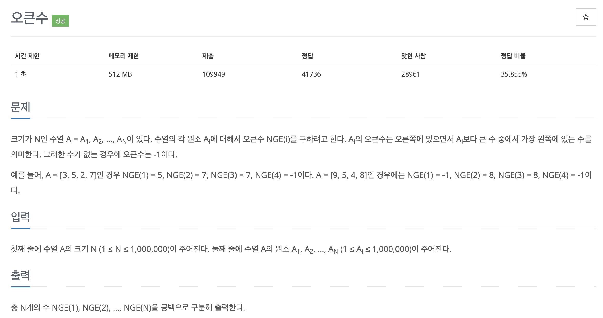

# 문제 012. 오큰수 구하기



### 필요한 아이디어

- 스택에 새로 들어오는 수가 top에 존재하는 수보다 크면 그 수는 오큰수가 된다.
- 오큰수를 구한 후 수열에서 오큰수가 존재하지 않는 숫자에 -1을 출력한다.

### 풀이 순서

1. 스택이 채워져 있고 A[index] > A[top]인 경우 pop한 인덱스를 이용하여 정답 수열에 오큰수를 저장한다.  
   pop은 조건을 만족하는 동안 계속 반복하며, 과정1을 마치면 과정2로 넘어간다.
2. 현재 인덱스를 스택에 push하고 다음 인덱스로 넘어간다.
3. 과정1~2를 수열의 길이만큼 반복한 다음 현재 스택에 남아 있는 인덱스에 -1을 저장한다.

### 문제집 풀이

```java
메모리 169132KB, 시간 920ms

public class P17298_오큰수 {

	public static void main(String[] args) throws NumberFormatException, IOException {
		BufferedReader br = new BufferedReader(new InputStreamReader(System.in));
		int n = Integer.parseInt(br.readLine());
		int[] A = new int [n];		// 수열 배열 생성
		int[] ans = new int [n];	// 정답 배열 생성
		String[] str = br.readLine().split(" ");
		for(int i=0; i<n; i++) {
			A[i] = Integer.parseInt(str[i]);
		}

		Stack<Integer> stack = new Stack<>();
		stack.push(0);		// 처음에는 항상 스택이 비어 있으므로 최초 값을 push하여 초기화

		for(int i=1; i<n; i++) {
			// 스택이 비어 있지 않고 현재 수열이 스택 top 인덱스가 가리키는 수열보다 클 경우
			while(!stack.isEmpty() && A[stack.peek()] < A[i]) {
				ans[stack.pop()] = A[i];	// 정답 배열에 오큰수를 현재 수열로 저장
			}
			stack.push(i);		// 신규 데이터 push
		}

		while(!stack.empty()) {
			// 반복문을 다 돌고 나왔는데 스택이 비어 있지 않다면 빌 때까지 스택에 쌓인 index의 정답 배열에 -1 넣기
			ans[stack.pop()] = -1;
		}

		BufferedWriter bw = new BufferedWriter(new OutputStreamWriter(System.out));
		for(int i=0; i<n; i++) {
			bw.write(ans[i] + " ");
		}

		bw.write("\n");
		bw.flush();
	}
}
```
