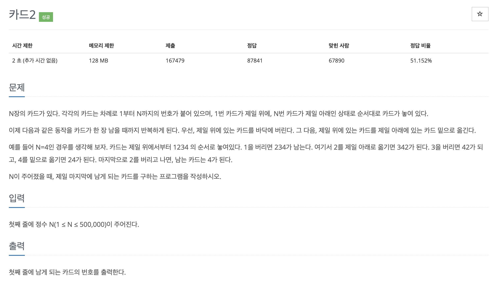

# 문제 013. 카드 게임



### 내가 작성한 풀이

```java
메모리 48992KB, 시간 228ms

public class P2164_카드 {

	public static void main(String[] args) {
		Scanner sc = new Scanner(System.in);
		int N = sc.nextInt();		// N장의 카드

		// 1번 카드가 가장 위, N번 카드가 가장 아래 상태가 되도록 세팅
		Queue<Integer> queue = new LinkedList<>();
		for(int i=1; i<=N; i++) {
			queue.add(i);
		}

		while(queue.size() >  1) {
			// 1. 가장 위에 있는 카드를 버린다.
			queue.poll();

			// 2. 그다음 가장 위에 있는 카드를 가장 아래 있는 카드 밑으로 옮긴다.
			queue.add(queue.poll());
		}

		System.out.println(queue.poll());
	}
}
```

### 문제집 풀이

```java
위의 풀이와 똑같아서 메모리, 시간 비교 pass

public class P2164_카드 {

	public static void main(String[] args) {
		Scanner sc = new Scanner(System.in);
		Queue<Integer> queue = new LinkedList<>();
		int N = sc.nextInt();
		for(int i=1; i<=N; i++) {	// 카드를 큐에 저장하기
			queue.add(i);
		}
		while(queue.size() >  1) {		// 카드가 1장 남을 때까지
			queue.poll();				// 맨 위의 카드를 버리기
			queue.add(queue.poll());	// 맨 위의 카드를 가장 아래 카드 밑으로 이동하기
		}

		System.out.println(queue.poll());	// 마지막으로 남은 카드 출력하기
	}
}
```
