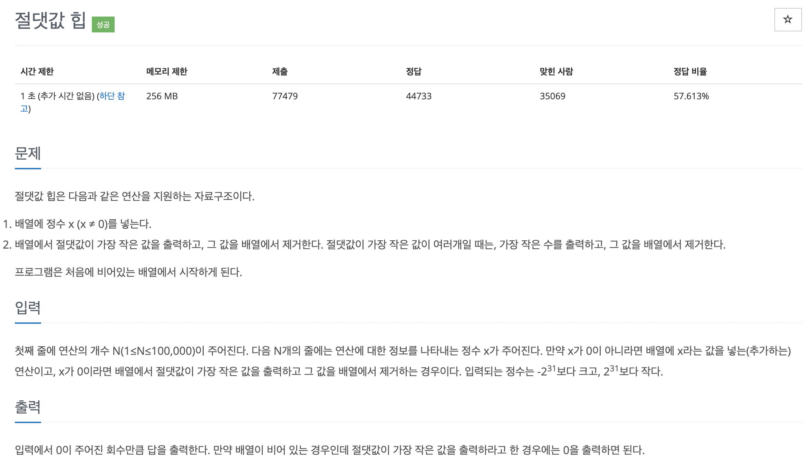

# 문제 014. 절댓값 힙 구현하기



### 내가 작성한 풀이 (오답)

```java
시간초과

class NumComparator implements Comparator<Integer> {

	@Override
	public int compare(Integer o1, Integer o2) {

		// 절댓값이 같다면 수의 크기를 비교
		if(Math.abs(o1) == Math.abs(o2)) {
			if(o1 > o2) {
				return 1;
			} else {
				return -1;
			}
		}

		// 절댓값이 가장 작은 값이 먼저 오도록 정렬
		if(Math.abs(o1) > Math.abs(o2)) {
			return 1;
		} else {
			return -1;
		}
	}
}

public class P11286_절댓값힙 {

	public static void main(String[] args) throws NumberFormatException, IOException {
		BufferedReader br = new BufferedReader(new InputStreamReader(System.in));
		int N = Integer.parseInt(br.readLine());	// 연산의 개수
		List<Integer> list = new ArrayList<Integer>();

		for(int i=0; i<N; i++) {
			int x = Integer.parseInt(br.readLine());	// 연산에 대한 정보를 나타내는 정수

			// x가 0이면 가장 작은 값을 출력
			if(x == 0) {
				if(list.size() == 0) {
					System.out.println(0);
				} else {
					Collections.sort(list, new NumComparator());	// 정렬
					System.out.println(list.remove(0));	// 가장 작은 값 출력하고 제거
				}
			} else {	// 그 외에는 x값을 배열에 추가
				list.add(x);
			}
		}
	}
}
```

### 필요한 아이디어

- N의 최대범위가 100,000으로 $O(nlogn)$ 시간 복잡도를 가진 알고리즘으로 풀 수 있다.
- 데이터가 새로 삽입될 때마다 절댓값과 관련된 정렬이 필요하므로 우선순위 큐로 문제를 해결
- 단, 절댓값 정렬이 필요하므로 우선순위 큐의 정렬 기준을 직접 정의해야 한다.

### 문제집 풀이

```java
메모리 26892KB, 시간 452ms

public class P11286_절댓값힙 {

	public static void main(String[] args) throws IOException {
		BufferedReader br = new BufferedReader(new InputStreamReader(System.in));
		int N = Integer.parseInt(br.readLine());

		PriorityQueue<Integer> queue = new PriorityQueue<Integer>((o1, o2) -> {
			int first_abs = Math.abs(o1);
			int second_abs = Math.abs(o2);

			if(first_abs == second_abs) {
				return o1 > o2 ? 1 : -1;	// 절댓값이 같으면 음수 우선 정렬
			} else {
				return first_abs - second_abs;
			}
		});

		for(int i=0; i<N; i++) {
			int request = Integer.parseInt(br.readLine());

			if(request == 0) {
				if(queue.isEmpty()) {
					System.out.println("0");
				} else {
					System.out.println(queue.poll());
				}
			} else {
				queue.add(request);
			}
		}
	}
}
```
