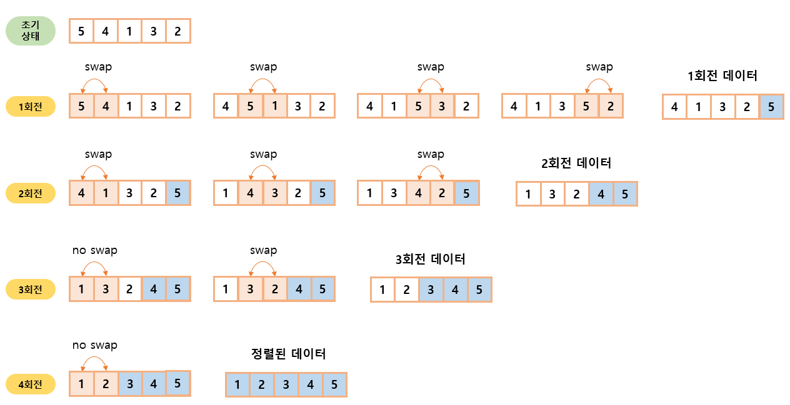

# 05-1. 버블 정렬

### 정렬 알고리즘 정의

| 정렬 알고리즘    | 정의                                                                                    |
| ---------------- | --------------------------------------------------------------------------------------- |
| 버블 (bubble)    | 데이터의 인접 요소끼리 비교하고, swap 연산을 수행하며 정렬하는 방식                     |
| 선택 (selection) | 대상에서 가장 크거나 작은 데이터를 찾아 선택하는 과정을 반복하면서 정렬하는 방식        |
| 삽입 (insertion) | 대상을 선택해 정렬된 영역에서 선택 데이터의 적절한 위치에 찾아 삽입하면서 정렬하는 방식 |
| 퀵 (quick)       | pivot 값을 선정해 해당 값을 기준으로 정렬하는 방식                                      |
| 병합 (merge)     | 이미 정렬된 부분 집합들을 효율적으로 병합해 전체를 정렬하는 방식                        |
| 기수 (radix)     | 데이터의 자릿수를 바탕으로 비교해 데이터를 정렬하는 방식                                |

 

### 버블 정렬 (bubble sort)

- 두 인접한 데이터의 크기를 비교해 정렬하는 방법
- 간단하게 구현할 수 있지만, 시간 복잡도가 $O(n^2)$ 으로 다른 정렬 알고리즘보다 속도가 느린 편이다.
- 루프(loop)를 돌면서 인접한 데이터 간의 swap 연산으로 정렬

#### 버블 정렬 과정

1. 비교 연산이 필요한 루프 범위를 설정한다.
2. 인접한 데이터 값을 비교한다.
3. swap 조건에 부합하면 swap 연산을 수행한다.
4. 루프 범위가 끝날 때까지 2~3을 반복한다.
5. 정렬된 영역을 설정한다. 다음 루프를 실행할 때는 이 영역을 제외한다.
6. 비교 대상이 없을 때까지 1~5를 반복한다.

   → 만약 특정한 루프의 전체 영역에서 swap이 한 번도 발생하지 않았다면, 그 영역 뒤에 있는 데이터가 모두 정렬됐다는 뜻이므로 프로세스를 종료해도 된다.

 

### 예제 문제

- [문제015. 수 정렬하기1](./문제015.%20수%20정렬하기1.md)
- [문제016. 버블 정렬 프로그램1](./문제016.%20버블%20정렬%20프로그램1.md)
