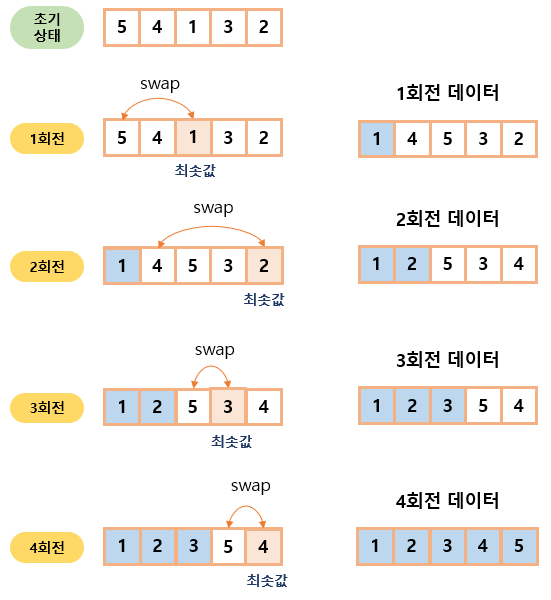

# 05-2. 선택 정렬

### 선택 정렬 (selection sort)

- 대상 데이터에서 최대나 최소 데이터를 데이터가 나열된 순으로 찾아가며 선택하는 방법
- 구현 방법이 복잡하고, 시간 복잡도도 $O(n^2)$으로 효율적이지 않아 코딩테스트에서는 많이 사용하지 않는다.
- 최솟값 또는 최댓값을 찾고, 남은 정렬 부분의 가장 앞에 있는 데이터와 swap하는 것이 선택 정렬의 핵심이다.

 

#### 선택 정렬 과정

1. 남은 정렬 부분에서 최솟값 또는 최댓값을 찾는다.
2. 남은 정렬 부분에서 가장 앞에 있는 데이터와 선택된 데이터를 swap한다.
3. 가장 앞에 있는 데이터의 위치를 변경해(index++) 남은 정렬 부분의 범위를 축소한다.
4. 전체 데이터의 크기만큼 index가 커질 때까지, 즉 남은 정렬 부분이 없을 떄까지 반복한다.

 

### 예제 문제

- [문제017. 내림차순으로 자릿수 정렬하기](./문제017.%20내림차순으로%20자릿수%20정렬하기.md)
