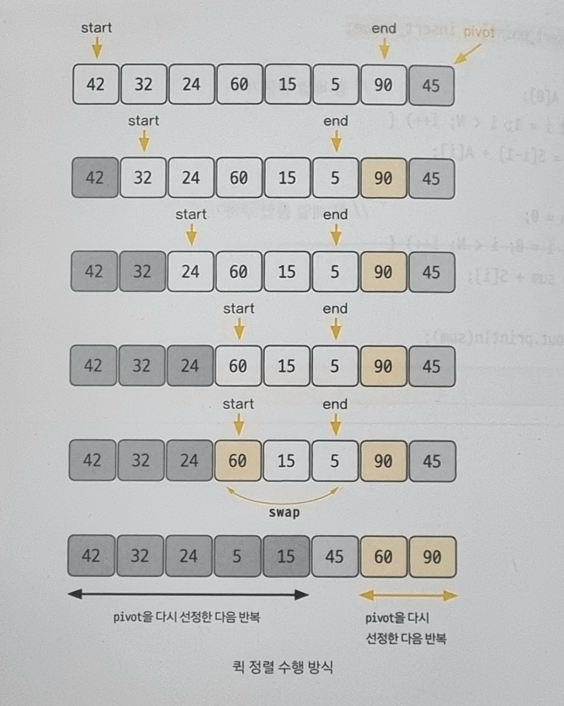

# 05-4. 퀵 정렬

### 퀵 정렬 (quick sort)

- 기준값(pivot)을 선정해 해당 값보다 작은 데이터와 큰 데이터로 분류하는 것을 반복해 정렬하는 알고리즘
- 기준값을 어떻게 선정하는지가 시간 복잡도에 많은 영향을 미치는데 평균적인 시간 복잡도는 $O(nlogn)$이다.

 

#### 퀵 정렬 과정

1. 데이터를 분할하는 pivot을 설정한다.
2. pivot을 기준으로 다음 a ~ e 과정을 거쳐 데이터를 2개의 집합으로 분리한다.  
   a. start가 가리키는 데이터가 pivot이 가리키는 데이터보다 작으면 start를 오른쪽으로 1칸 이동한다.  
   b. end가 가리키는 데이터가 pivot이 가리키는 데이터보다 크면 end를 왼쪽으로 1칸 이동한다.  
   c. start가 가리키는 데이터가 pivot이 가리키는 데이터보다 크고, end가 가리키는 데이터가 pivot이 가리키는 데이터보다 작으면 start, end가 가리키는 데이터를 swap하고 start는 오른쪽, end는 왼쪽으로 1칸씩 이동한다.  
   d. start와 end가 만날 때까지 a ~ c를 반복한다.  
   e. start와 end가 만나면 만난 지점에서 가리키는 데이터와 pivot이 가리키는 데이터를 비교하여 pivot이 가리키는 데이터가 크면 만난 지점의 오른쪽에, 작으면 만난 지점의 왼쪽에 pivot이 가리키는 데이터를 삽입한다.
3. 분리 집합에서 각각 다시 pivot을 선정한다.
4. 분리 집합의 요소가 1개 이하가 될 때까지 과정 1~3을 반복한다.

 

### 예제 문제

- [문제019. K번째 수 구하기](./문제019.%20K번째%20수%20구하기.md)
