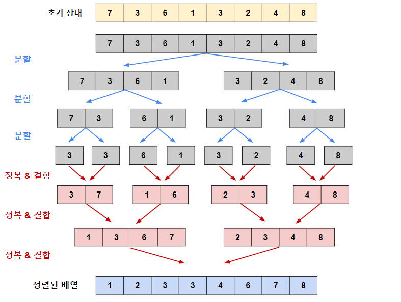

# 05-5. 병합 정렬

### 병합 정렬 (merge sort)

- 분할 정복(divide and conquer) 방식을 사용해 데이터를 분할하고 분할한 집합을 정렬하며 합치는 알고리즘
- 병합 정렬의 시간 복잡도 평균값은 $O(nlogn)$이다.

 

#### 병합 정렬 과정

1. 가장 작은 데이터 집합으로 분할
2. 이 상태에서 2개씩 그룹을 합치면서 오름차순 정렬
3. 2그룹씩 합치면서 오름차순 정렬하는 방식을 반복하면 전체를 오름차순으로 정렬할 수 있다.

   **→ 2개의 그룹을 병합하는 과정**

   - 투 포인터 개념을 사용하여 왼쪽, 오른쪽 그룹을 병합한다. 왼쪽 포인터와 오른쪽 포인터의 값을 비교하여 작은 값을 결과 배열에 추가하고 포인터를 오른쪽으로 1칸 이동시킨다.

 

### 예제 문제

- [문제020. 수 정렬하기2](./문제20.%20수%20정렬하기2.md)
- [문제021. 버블 정렬 프로그램](./문제021.%20버블%20정렬%20프로그램.md)
