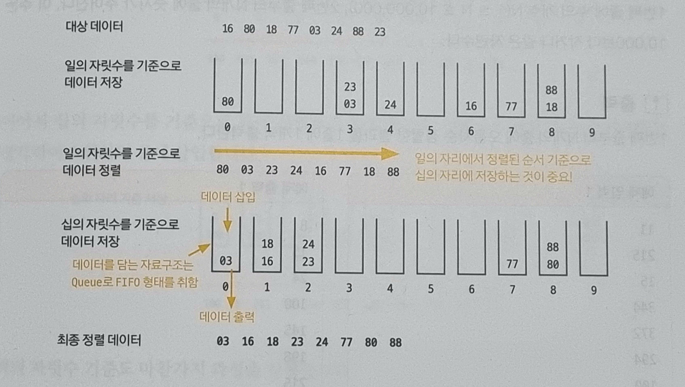

# 05-6. 기수 정렬

### 기수 정렬 (radix sort)

- 값을 비교하지 않는 특이한 정렬로, 값을 놓고 비교할 자릿수를 정한 다음 해당 자릿수만 비교한다.
- 기수 정렬의 시간 복잡도는 $O(kn)$으로, 여기서 k는 데이터의 자릿수를 말한다.
- 시간 복잡도가 가장 짧은 정렬

 

#### 기수 정렬의 핵심 이론

- 기수 정렬은 10개의 큐를 이용하며, 각 큐는 값의 자릿수르 대표한다.

  

 

#### 기수 정렬 수행 방식

1. 원본 배열의 일의 자릿수 기준으로 배열 원소를 큐에 집어넣는다.
2. 이후 0번째 큐부터 9번째 큐까지 pop을 진행
3. 이어서 십의 자릿수를 기준으로 같은 과정을 진행
4. 마지막 자릿수를 기준으로 정렬할 때까지 앞의 과정을 반복

 

### 예제 문제

- [문제022. 수 정렬하기3](./문제022.%20수%20정렬하기3.md)
