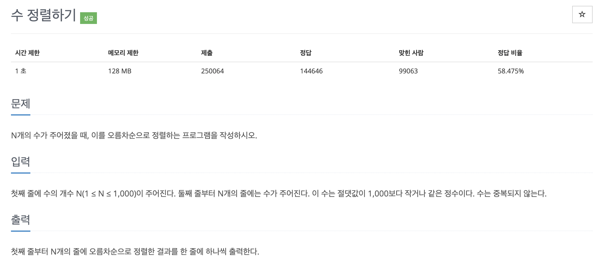

# 문제 015. 수 정렬하기1



### 내가 작성한 풀이

```java
메모리 22404KB, 시간 264ms

public class P2750_수정렬하기 {

	public static void main(String[] args) {
		Scanner sc = new Scanner(System.in);
		int N = sc.nextInt();	// 수의 개수

		int[] arr = new int [N];
		for(int i=0; i<N; i++) {
			arr[i] = sc.nextInt();
		}

		Arrays.sort(arr);

		for(int i=0; i<N; i++) {
			System.out.println(arr[i]);
		}
	}
}
```

### 문제집 풀이 (버블정렬 직접 구현해서 풀이)

→ N의 최대 범위가 1,000으로 매우 작기 때문에 $O(n^2)$ 시간 복잡도 알고리즘으로 풀수 있다.

```java
메모리 22356KB, 시간 280ms

public class P2750_수정렬하기 {

	public static void main(String[] args) {
		Scanner sc = new Scanner(System.in);
		int N = sc.nextInt();
		int[] A = new int [N];
		for(int i=0; i<N; i++) {
			A[i] = sc.nextInt();
		}

		for(int i=0; i<N-1; i++) {
			for(int j=0; j<N-1-i; j++) {
				if(A[j] > A[j+1]) {
					int temp = A[j];
					A[j] = A[j+1];
					A[j+1] = temp;
				}
			}
		}

		for(int i=0; i<N; i++) {
			 System.out.println(A[i]);
		}
	}
}
```
