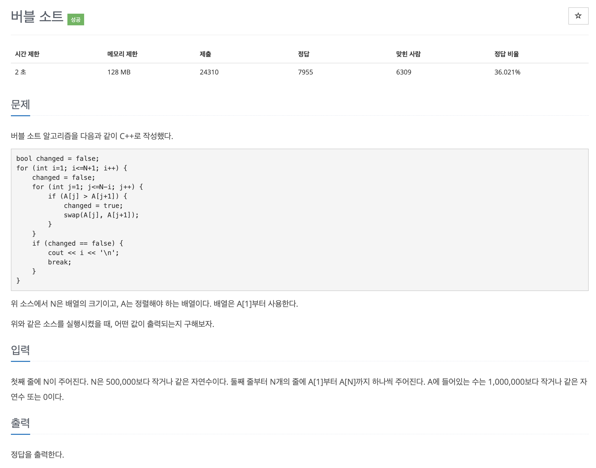

# 문제 016. 버블 정렬 프로그램



### 문제 분석

- 버블 정렬의 swap이 한 번도 일어나지 않은 루프가 언제인지 알아내는 문제
- '버블 정렬의 이중 for문에서 안쪽 for문 전체를 돌 때 swap이 일어나지 않았다'는 것은 이미 모든 데이터가 정렬됐다는 것을 의미한다. 이때 프로세스를 바로 종료해 시간 복잡도를 줄일 수 있다. 하지만 이 문제는 N의 최대 범위가 500,000이므로 버블 정렬로 문제를 풀면 시간을 초과할 수 있다.

### 필요한 아이디어

- 안쪽 루프는 1에서 n-i까지, 즉 왼쪽에서 오른쪽으로 이동하면서 swap을 수행한다. 이는 특정 데이터가 안쪽 루프에서 swap의 왼쪽으로 이동할 수 있는 최대 거리가 1이라는 뜻이다. 즉, 데이터의 정렬 전 index와 정렬 후 index를 비교해 왼쪽으로 가장 많이 이동한 값을 찾으면 해결할 수 있다.

### 문제집 풀이

```java
메모리 82676KB, 시간 1528ms

class mData implements Comparable<mData> {
	int value;
	int index;

	public mData(int value, int index) {
		super();
		this.value = value;
		this.index = index;
	}

	@Override
	public int compareTo(mData o) {
		// value 기준 오름차순 정렬
		return this.value - o.value;
	}
}

public class P1377_버블정렬1 {

	public static void main(String[] args) throws IOException {
		BufferedReader br = new BufferedReader(new InputStreamReader(System.in));
		int N = Integer.parseInt(br.readLine());
		mData[] A = new mData[N];
		for(int i=0; i<N; i++) {
			A[i] = new mData(Integer.parseInt(br.readLine()), i);
		}
		Arrays.sort(A);
		int max = 0;
		for(int i=0; i<N; i++) {
			if(max < A[i].index - i) {
				max = A[i].index - i;
			}
		}
		System.out.println(max+1);
	}
}

```
