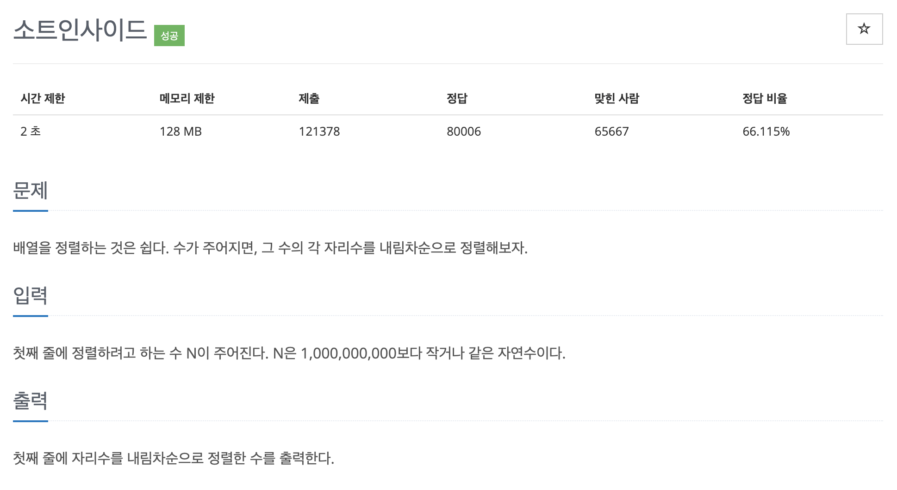

# 문제 017. 내림차순으로 자릿수 정렬하기



### 내가 작성한 풀이

```java
메모리 17612KB, 시간 176ms

public class P1427_내림차순정렬 {

	public static void main(String[] args) {
		Scanner sc = new Scanner(System.in);

		// 각 자리수 구분해서 저장
		String[] strArr = sc.next().split("");
		int[] nums = new int [strArr.length];
		for(int i=0; i<strArr.length; i++) {
			nums[i] = Integer.parseInt(strArr[i]);
		}

		for(int start=0; start<nums.length-1; start++) {
			// 1. 남은 정렬 부분에서 최댓값 인덱스 구하기
			int maxIndex = calMax(nums, start);

			// 2. 남은 정렬 부분에서 가장 앞에 있는 데이터와 선택된 데이터를 swap
			int temp = nums[start];
			nums[start] = nums[maxIndex];
			nums[maxIndex] = temp;
		}

		// 내림차순으로 정렬한 수를 출력
		for(int i=0; i<nums.length; i++) {
			System.out.print(nums[i]);
		}
	}

	private static int calMax(int[] nums, int start) {
		int maxIndex = start;

		for(int i=start+1; i<nums.length; i++) {
			maxIndex = (nums[i] > nums[maxIndex]) ? i : maxIndex;
		}

		return maxIndex;
	}
}
```

### 문제집 풀이

```java
메모리 17596KB, 시간 164ms

public class P1427_내림차순정렬 {

	public static void main(String[] args) {
		Scanner sc = new Scanner(System.in);
		String str = sc.next();
		int[] A = new int [str.length()];
		for(int i=0; i<str.length(); i++) {
			A[i] = Integer.parseInt(str.substring(i, i+1));
		}

		for(int i=0; i<str.length(); i++) {
			int max = i;
			for(int j=i+1; j<str.length(); j++) {
				if(A[j] > A[max]) {		// 내림차순이므로 최댓값을 찾음
					max = j;
				}

				if(A[i] < A[max]) {
					int temp = A[i];
					A[i] = A[max];
					A[max] = temp;
				}
			}
		}

		for(int i=0; i<str.length(); i++) {
			System.out.print(A[i]);
		}
	}
}
```
