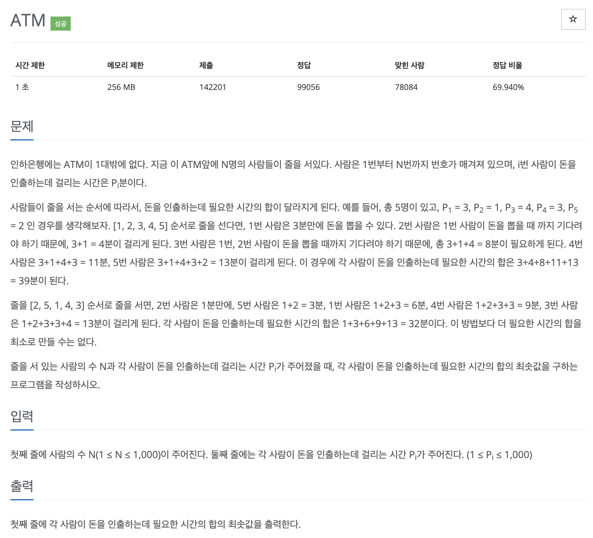

# 문제 018. ATM 인출 시간 계산하기



### 내가 작성한 풀이

```java
메모리 21068KB, 시간 232ms

public class P11399_ATM {

	public static void main(String[] args) {
		Scanner sc = new Scanner(System.in);
		int N = sc.nextInt();			// 사람의 수

		int[] waiting = new int [N];	// 각 사람이 돈을 인출하는데 걸리는 시간
		for(int i=0; i<N; i++) {
			waiting[i] = sc.nextInt();
		}

		// 삽입정렬 구현
		for(int i=1; i<waiting.length; i++) {
			// 1. 정렬해야 되는 데이터 선택
			int selDataIdx = i;

			// 2. 정렬된 데이터 범위에 적절한 위치에 삽입
			for(int j=i-1; j>=0; j--) {
				if(waiting[selDataIdx] < waiting[j]) {
					int temp = waiting[j];
					waiting[j] = waiting[selDataIdx];
					waiting[selDataIdx] = temp;
					selDataIdx = j;
				} else {
					break;
				}
			}
		}

		// 각 사람이 돈을 인출하는데 필요한 시간의 합
		int waitingTime = 0;
		int total = 0;
		for(int i=0; i<waiting.length; i++) {
			waitingTime = waitingTime + waiting[i];
			total += waitingTime;
		}

		System.out.println(total);
	}
}
```

### 문제집 풀이

```java
메모리 21256KB, 시간 244ms

public class P11399_ATM {

	public static void main(String[] args) {
		Scanner sc = new Scanner(System.in);
		int N = sc.nextInt();
		int[] A = new int [N];
		int[] S = new int [N];
		for(int i=0; i<N; i++) {
			A[i] = sc.nextInt();
		}

		// 삽입정렬
		for(int i=1; i<N; i++) {
			int insert_point = i;
			int insert_value = A[i];

			for(int j=i-1; j>=0; j--) {
				if(A[j] < A[i]) {
					insert_point = j+1;
					break;
				}

				if(j == 0) {
					insert_point = 0;
				}
			}

			for(int j=i; j>insert_point; j--) {
				A[j] = A[j-1];
			}

			A[insert_point] = insert_value;
		}

		// 합 배열 만들기
		S[0] = A[0];
		for(int i=1; i<N; i++) {
			S[i] = S[i-1] + A[i];
		}

		// 합 배열 총합 구하기
		int sum = 0;
		for(int i=0; i<N; i++) {
			sum = sum + S[i];
		}

		System.out.println(sum);
	}
}
```
