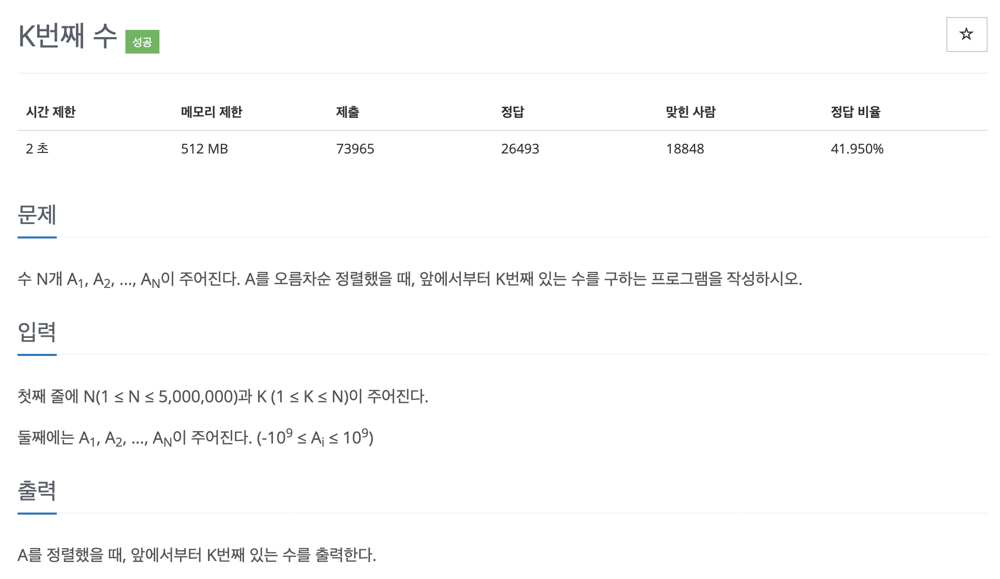

# 문제 019. K번째 수 구하기



### 내가 작성한 풀이 (오답)

```java
시간초과

public class P11004_K번째수 {

	public static void main(String[] args) {
		Scanner sc = new Scanner(System.in);
		int N = sc.nextInt();	// 주어지는 수 개수
		int K = sc.nextInt();	// 오름차순 정렬했을 때 K번째 있는 수

		int[] nums = new int [N];
		for(int i=0; i<N; i++) {
			nums[i] = sc.nextInt();
		}

		Arrays.sort(nums);
		System.out.println(nums[K-1]);
	}
}
```

### 문제 분석

- N의 최대범위가 5,000,000이므로 $O(nlogn)$의 시간 복잡도로 정렬을 수행해야 된다.
- 단, 이 문제는 시간 복잡도가 민감하므로 퀵 정렬 알고리즘에서 K번째 수를 좀 더 빨리 구하기 위한 고민이 필요하다.
- 어떤 값을 pivot으로 정하면 K번째 수를 더 빨리 구할 수 있는지, pivot을 정하는 방법

  - pivot == K : K번째 수를 찾은 것이므로 알고리즘을 종료한다.
  - pivot > K : pivot의 왼쪽 부분에 K가 있으므로 왼쪽(S ~ pivot-1)만 정렬을 수행
  - pivot < K : pivot의 오른쪽 부분에 K가 있으므로 오른쪽(pivot+1 ~ E)만 정렬을 수행

    → 데이터가 대부분 정렬되어 있는 경우 앞쪽에 있는 수를 pivot으로 선택하면 불필요한 연산이 많아진다. 따라서 해당 문제는 배열의 중간 위치를 pivot으로 설정

### 문제집 풀이

```java
메모리 368368KB, 시간 1028ms

public class P11004_K번째수 {

	public static void main(String[] args) throws IOException {
		BufferedReader br = new BufferedReader(new InputStreamReader(System.in));
		StringTokenizer st = new StringTokenizer(br.readLine());
		int N = Integer.parseInt(st.nextToken());
		int K = Integer.parseInt(st.nextToken());

		st = new StringTokenizer(br.readLine());
		int[] A = new int [N];
		for(int i=0; i<N; i++) {
			A[i] = Integer.parseInt(st.nextToken());
		}

		quickSort(A, 0, N-1, K-1);
		System.out.println(A[K-1]);
	}

	private static void quickSort(int[] A, int S, int E, int K) {
		if (S < E) {
			int pivot = partition(A, S, E);

			if(pivot == K) {			// K번째 수가 pivot이면 더이상 구할 필요 없음
				return;
			} else if (K < pivot) {		// K가 pivot보다 작으면 왼쪽 그룹만 정렬 수행
				quickSort(A, S, pivot-1, K);
			} else {					// K가 pivot보다 크면 오른쪽 그룹만 정렬 수행
				quickSort(A, pivot+1, E, K);
			}
		}
	}

	private static int partition(int[] A, int S, int E) {
		if(S+1 == E) {
			if(A[S] > A[E]) {
				swap(A, S, E);
			}

			return E;
		}

		int M = (S+E) / 2;
		swap(A, S, M);		// 중앙값을 1번째 요소로 이동

		int pivot = A[S];
		int i = S+1, j = E;
		while (i <= j) {
			while (j >= S+1 && pivot < A[j]) {		// 피벗보다 작은 수가 나올 때까지 j--
				j--;
			}

			while (i <= E && pivot > A[i]) {		// 피벗보다 큰 수가 나올 때까지 i++
				i++;
			}

			if(i <= j) {
				swap(A, i++, j--);
			}
		}

		// 피벗 데이터를 나눠진 두 그룹의 경계 index에 저장하기
		A[S] = A[j];
		A[j] = pivot;
		return j;
	}

	private static void swap(int[] A, int i, int j) {
		int temp = A[i];
		A[i] = A[j];
		A[j] = temp;
	}
}
```
