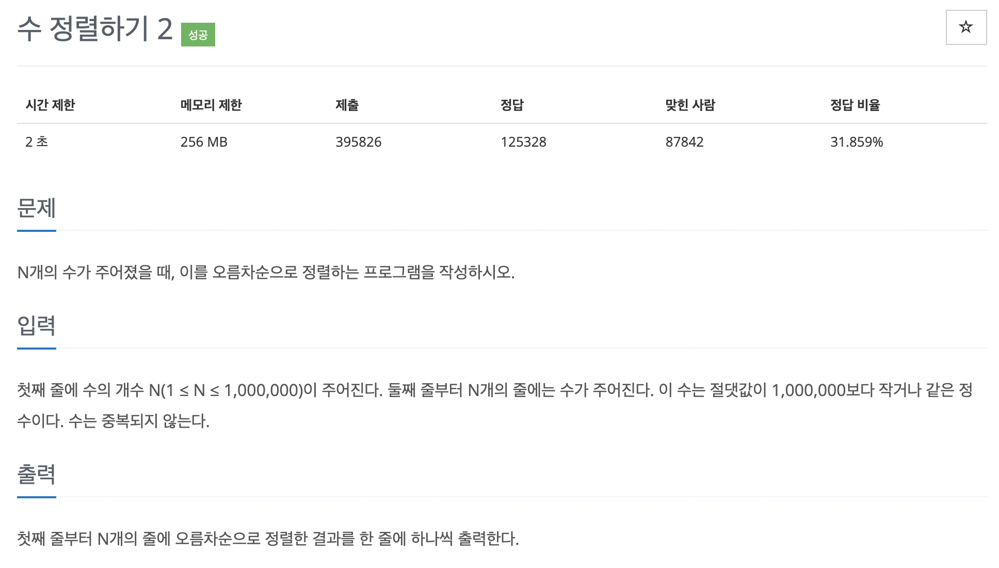

# 문제 020. 수 정렬하기2



### 내가 작성한 풀이

```java
메모리 116932KB, 시간 1316ms
Scanner과 System.out.println()을 사용하면 시간 초과 발생

public class P2751_수정렬하기2 {

	public static void main(String[] args) throws NumberFormatException, IOException {
		BufferedReader br = new BufferedReader(new InputStreamReader(System.in));
		BufferedWriter bw = new BufferedWriter(new OutputStreamWriter(System.out));

		int N = Integer.parseInt(br.readLine());	// 수의 개수
		int[] arr = new int [N];
		for(int i=0; i<N; i++) {
			arr[i] = Integer.parseInt(br.readLine());
		}

		Arrays.sort(arr);

		for(int i=0; i<N; i++) {
			bw.write(arr[i]+"\n");
		}

		bw.close();
	}
}

```

### 문제집 풀이

```java
메모리 115900KB, 시간 1000ms

public class P2751_수정렬하기2 {

	public static int[] A, tmp;

	public static void main(String[] args) throws IOException {
		BufferedReader br = new BufferedReader(new InputStreamReader(System.in));
		BufferedWriter bw = new BufferedWriter(new OutputStreamWriter(System.out));

		int N = Integer.parseInt(br.readLine());
		A = new int [N+1];
		tmp = new int [N+1];
		for(int i=1; i<=N; i++) {
			A[i] = Integer.parseInt(br.readLine());
		}

		merge_sort(1, N);		// 병합정렬 수행

		for(int i=1; i<=N; i++) {
			bw.write(A[i] + "\n");
		}

		bw.flush();
		bw.close();
	}

	private static void merge_sort(int s, int e) {
		if(e-s < 1) {
			return;
		}

		int m = s + (e-s) / 2;

		// 재귀함수 형태로 구현
		merge_sort(s, m);
		merge_sort(m+1, e);

		for(int i=s; i<=e; i++) {
			tmp[i] = A[i];
		}

		int k = s;
		int index1 = s;
		int index2 = m+1;

		while(index1 <= m && index2 <= e) {		// 두 그룹을 병합하는 로직
			// 양쪽 그룹의 index가 가리키는 값을 비교해 더 작은 수를 선택해 배열에 저장하고, 선택된 데이터의 index 값을 오른쪽으로 한 칸 이동하기
			if(tmp[index1] > tmp[index2]) {
				A[k] = tmp[index2];
				k++;
				index2++;
			} else {
				A[k] = tmp[index1];
				k++;
				index1++;
			}
		}

		while(index1 <= m) {		// 한쪽 그룹이 모두 선택된 후 남아 있는 값 정리하기
			A[k] = tmp[index1];
			k++;
			index1++;
		}

		while(index2 <= e) {
			A[k] = tmp[index2];
			k++;
			index2++;
		}
	}
}
```
