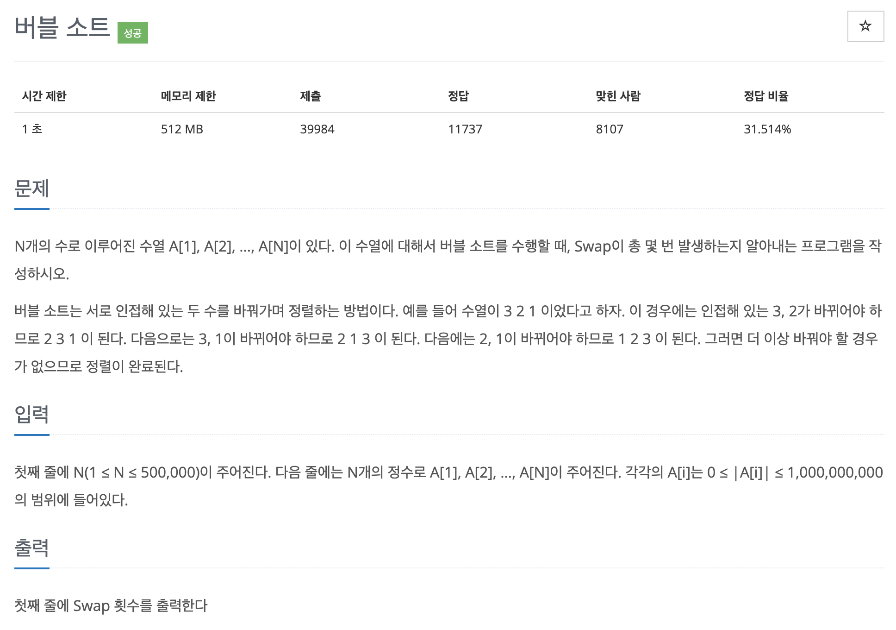

# 문제 021. 버블 정렬 프로그램



### 문제 분석

- 제목은 버블 정렬이지만, N의 최대 범위가 500,000이므로 버블 정렬을 사용하면 제한 시간을 초과
- 따라서, 이 문제는 버블 정렬이 아닌 $O(nlogn)$의 시간복잡도를 가진 병합 정렬을 사용해야 한다.
- 뒤쪽 데이터 값이 더 작아 선택할 때 swap이 일어났다고 가정하고, 현재 남아 있는 앞쪽 데이터 개수만큼 결괏값에 더함

### 문제집 풀이

```java
메모리 72440KB, 시간 524ms

public class P1517_버블정렬2 {

	private static int[] nums, temp;
	private static long swap;

	public static void main(String[] args) throws IOException {
		BufferedReader br = new BufferedReader(new InputStreamReader(System.in));

		int N = Integer.parseInt(br.readLine());
		nums = new int [N];
		temp = new int [N];

		StringTokenizer st = new StringTokenizer(br.readLine());
		for(int i=0; i<N; i++) {
			nums[i] = Integer.parseInt(st.nextToken());
		}

		swap = 0;
		merge_sort(0, N-1);

		System.out.println(swap);
	}

	private static void merge_sort(int start, int end) {
		if(start >= end) {
			return;
		}

		int center = start + ((end-start) / 2);

		merge_sort(start, center);
		merge_sort(center+1, end);

		for(int i=start; i<=end; i++) {
			temp[i] = nums[i];
		}

		int idx = start;
		int point1 = start;
		int point2 = center + 1;

		while(point1 <= center && point2 <= end) {
			if(temp[point1] > temp[point2]) {
				swap += (point2 - idx);		// 뒤쪽 데이터 값이 작은 경우 swap 발생 횟수 업데이트
				nums[idx] = temp[point2];
				idx++;
				point2++;
			}  else {
				nums[idx] = temp[point1];
				idx++;
				point1++;
			}
		}

		while(point1 <= center) {
			nums[idx] = temp[point1];
			idx++;
			point1++;
		}

		while(point2 <= end) {
			nums[idx] = temp[point2];
			idx++;
			point2++;
		}
	}
}
```
