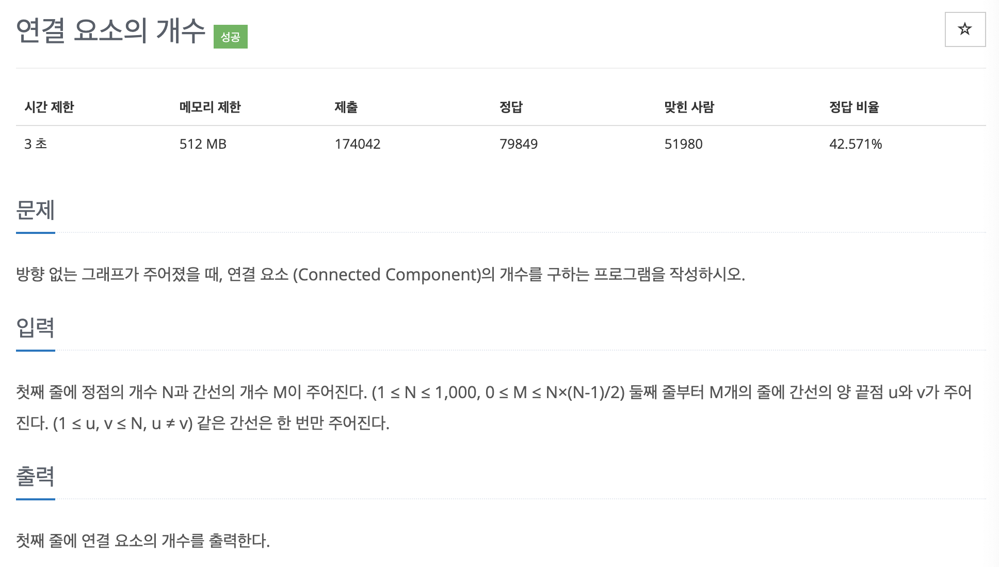

# 문제 023. 연결 요소의 개수 구하기



### 내가 작성한 풀이

```java
메모리 116672KB, 시간 468ms

public class P11724_연결요소의개수 {

	static int[][] arr;
	static boolean[] visited;

	public static void main(String[] args) throws IOException {
		BufferedReader br = new BufferedReader(new InputStreamReader(System.in));
		StringTokenizer st = new StringTokenizer(br.readLine());

		int N = Integer.parseInt(st.nextToken());	// 정점의 개수
		int M = Integer.parseInt(st.nextToken());	// 간선의 개수

		arr = new int [N+1][N+1];		// 간선 연결 배열
		for(int i=0; i<M; i++) {
			st = new StringTokenizer(br.readLine());
			int u = Integer.parseInt(st.nextToken());
			int v = Integer.parseInt(st.nextToken());

			arr[u][v] = arr[v][u] = 1;
		}

		visited = new boolean [N+1];	// 방문체크 배열
		int answer = 0;					// 연결요소의 개수

		for(int i=1; i<=N; i++) {
			if(!visited[i]) {
				answer++;	// 새로운 연결 시작
				dfs(i);
			}
		}

		System.out.println(answer);
	}

	private static void dfs(int idx) {
		visited[idx] = true;	// 방문체크

		for(int i=1; i<arr[idx].length; i++) {
			// 이미 방문한 배열이거나 간선 연결되어 있지 않은 경우 pass
			if(visited[i] || arr[idx][i] != 1) {
				continue;
			}

			dfs(i);
		}
	}
}
```

### 문제집 풀이

```java
메모리 141956KB, 시간 604ms

public class P11724_연결요소의개수 {

	static ArrayList<Integer>[] A;
	static boolean[] visited;

	public static void main(String[] args) throws IOException {
		BufferedReader br = new BufferedReader(new InputStreamReader(System.in));
		StringTokenizer st = new StringTokenizer(br.readLine());

		int n = Integer.parseInt(st.nextToken());
		int m = Integer.parseInt(st.nextToken());

		A = new ArrayList[n+1];
		visited = new boolean [n+1];
		for(int i=1; i<n+1; i++) {				// 인접 리스트 초기화
			A[i] = new ArrayList<Integer>();
		}

		for(int i=0; i<m; i++) {
			st = new StringTokenizer(br.readLine());
			int s = Integer.parseInt(st.nextToken());
			int e = Integer.parseInt(st.nextToken());

			A[s].add(e);	// 양방향 에지이므로 양쪽에 에지를 더하기
			A[e].add(s);
		}

		int count = 0;
		for(int i=1; i<n+1; i++) {
			if(!visited[i]) {	// 방문하지 않은 노드가 없을때까지 반복
				count++;
				DFS(i);
			}
		}

		System.out.println(count);
	}

	private static void DFS(int v) {
		if(visited[v]) {
			return;
		}

		visited[v] = true;

		for(int i : A[v]) {
			if(visited[i] == false) {		// 연결 노드 중 방문하지 않았던 노드만 탐색하기
				DFS(i);
			}
		}
	}
}
```
