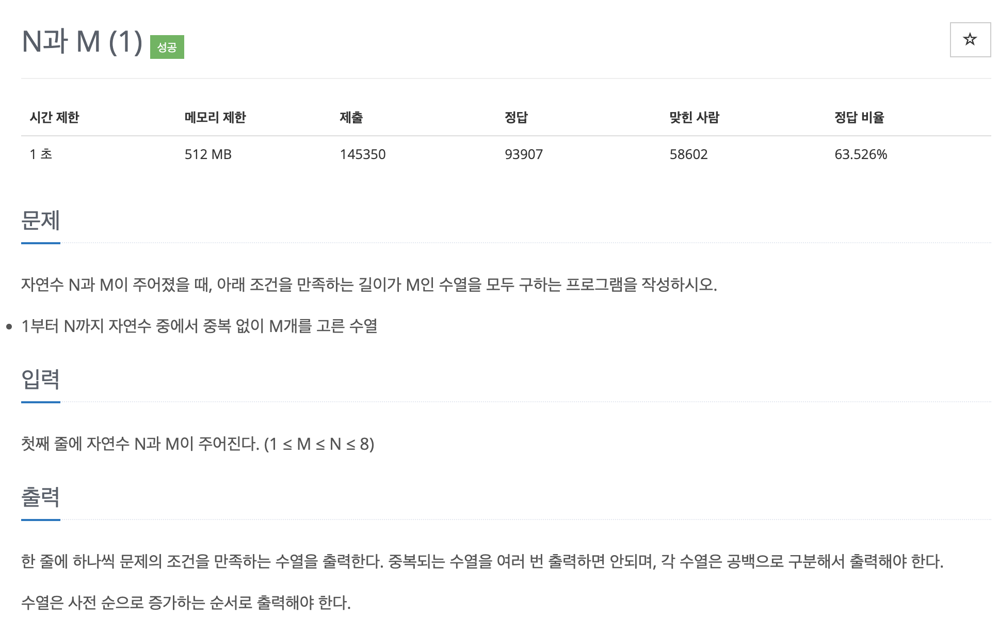

# 문제 026. N과 M



### 내가 작성한 풀이

```java
메모리 34480KB, 시간 344ms

public class P15649_N과M {

	static int N;
	static int M;
	static boolean[] visited;

	static BufferedWriter bw = new BufferedWriter(new OutputStreamWriter(System.out));

	public static void main(String[] args) throws IOException {
		Scanner sc = new Scanner(System.in);

		N = sc.nextInt();				// 1부터 N까지 자연수 중에서
		M = sc.nextInt();				// 중복없이 M개를 고른 수열
		visited = new boolean [N+1];	// 중복이 없어야 하므로 사용한 자연수 체크

		makeSequence(new int [M], 0);

		bw.flush();
		bw.close();
	}

	/**
	 * 수열 만들기
	 */
	private static void makeSequence(int[] arr, int idx) throws IOException {
		if(idx >= M) {				// 수열이 만들어졌다면 출력
			printSequence(arr);
			return;
		}

		for(int i=1; i<=N; i++) {
			if(visited[i]) {		// 이미 사용한 수는 pass
				continue;
			}

			arr[idx] = i;
			visited[i] = true;
			makeSequence(arr, idx+1);
			visited[i] = false;
		}
	}

	/**
	 * 만들어진 수열 출력
	 */
	private static void printSequence(int[] arr) throws IOException {
		for(int i=0; i<arr.length; i++) {
			bw.write(arr[i]+ " ");
		}

		bw.write("\n");
	}
}
```

### 문제집 풀이

```java
메모리 53756KB, 시간 1608ms

public class P15649_N과M {

	static int N, M;
	static boolean[] V;
	static int[] S;

	public static void main(String[] args) {
		Scanner sc = new Scanner(System.in);
		N = sc.nextInt();
		M = sc.nextInt();
		S = new int [N];
		V = new boolean [N];

		backtracking(0);
	}

	private static void backtracking(int length) {
		if(length == M) {		// 길이가 M인 수열이 만들어진 경우
			printArray();
			return;
		}

		for(int i=0; i<N; i++) {
			if(!V[i]) {
				V[i] = true;				// 수 사용 저장하기
				S[length] = i;				// 수열에 수 사용하기
				backtracking(length + 1);
				V[i] = false;				// 수 반납 저장하기
			}
		}
	}

	private static void printArray() {		// 수열 내용 출력하기
		for(int i=0; i<M; i++) {
			System.out.print((S[i] + 1) + " ");
		}
		System.out.println();
	}
}

```
