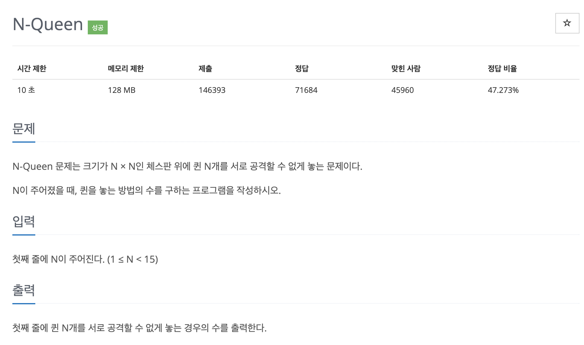

# 문제 027. N-Queen 배치하기



### 문제 분석

- N의 크기가 최대 15이므로 시간 복잡도는 크게 고려할 필요 없다.
- 체스에스 퀸은 가로, 세로, 대각선으로 공격할 수 있으므로 같은 행에는 퀸이 1개만 존재할 수 있다.  
  → 이를 확장해서 생각해 보면, 결국 모든 행에 퀸을 1개씩 배치해야 N개의 퀸을 서로 공격하지 않도록 놓을 수 있다.
- 따라서, 맨 위 행부터 시작해 각 행마다 퀸을 하나씩 배치하며 가능한 모든 경우의 수를 찾는 방식으로 접근

### 풀이 순서

1. 가능한 선택지 탐색
   - 현재 행에서 퀸을 놓을 수 있는 위치를 탐색
2. 유효성 검사 및 가지치기
   - 해당 위치에 퀸을 배치할 때 다른 퀸과 서로 공격할 수 있는지 확인.
   - 공격할 수 있다면 탐색을 종료하고 이전 단계로 돌아간다.
3. 해답 도출

   - 마지막 행까지 퀸 배치를 모두 완료하면 경우의 수를 1 증가시키고, 백트래킹 전체를 종료하면 경우의 수를 출력

   **추가!**

   - N x N인 체스판이 주어지므로 문제를 이차원 배열로 생각할 수 있지만, 일차원 배열로도 퀸 배치 정보를 저장할 수 있다.
   - 일차원 배열의 인덱스를 행, 값을 열로 생각한다.
   - 퀸의 배치 정보를 일차원 배열로 저장하면 공격 가능 여부를 쉽게 구현할 수 있다.
     - 추가하려는 값이 기존 배열에 존재한다면 퀸이 같은 열에 이미 배치되어 있다는 뜻
     - 인덱스의 차이와 값의 차이가 같은 데이터가 있다면 대각선상에 퀸이 배치되어 있다는 의미
   - 같은 행에 검사를 따로 하지 않는 이유는 처음 로직을 설계할 때 각 행에 퀸을 하나씩만 배치하도록 구성했기 때문. 일차원 배열에서 인덱스는 항상 유일한 값을 가지고 있다고 판단 가능

<br />

### 문제집 풀이

```java
메모리 17828KB, 시간 5968ms

public class P9663_NQueen {

	static int[] A;			// 퀸 배치 정보 저장
	static int N;			// 체스판 크기 N*N
	static int cnt = 0;		// 퀸을 배치하는 경우의 수 저장

	public static void main(String[] args) {
		Scanner sc = new Scanner(System.in);
		N = sc.nextInt();
		A = new int [N];

		backtracking(0);

		System.out.println(cnt);
	}

	private static void backtracking(int row) {
		if(row == N) {		// 퀸 N개를 모두 배치한 경우
			cnt++;
			return;
		}

		for(int i=0; i<N; i++) {
			A[row] = i;

			if(check(row)) {	// 배치한 퀸이 이전 퀸들과 서로 공격할 수 없는지 체크
				backtracking(row + 1);
			}
		}
	}

	private static boolean check(int row) {
		for(int i=0; i<row; i++) {
			if(A[i] == A[row]) {	// 일직선 배치
				return false;
			}

			if(Math.abs(row - i) == Math.abs(A[i] - A[row])) {	// 대각선 배치
				return false;
			}
		}
		return true;
	}
}
```
