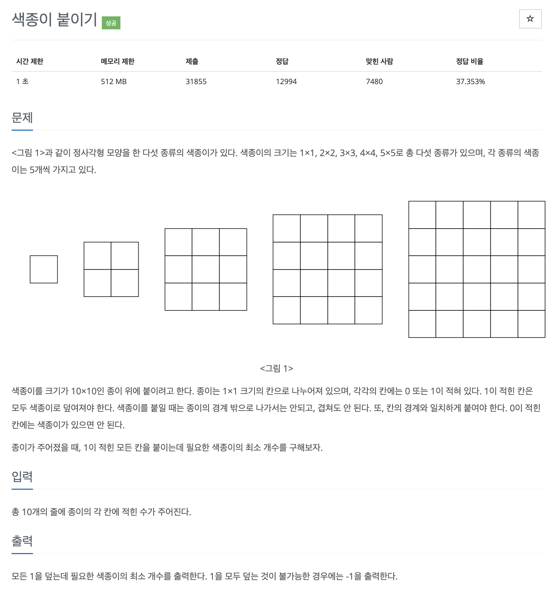

# 문제 028. 색종이 붙이기



### 문제 분석

- 종이의 크기가 10x10이고 색종이의 개수가 25개로 많지 않으므로, 색종이를 붙일 수 있는 경우의 수를 모두 탐색하면 됨

### 풀이 순서

1. 가능한 선택지 탐색
   - 색종이를 붙일 수 있는 1번째 위치를 찾는 것부터 시작
   - 탐색 위치는 왼쪽 위에서 시작하여 오른쪽으로 이동하고, 오른쪽 끝에 도달하면 한 줄 아래로 내려가서 다시 왼쪽부터 이동하는 방식으로 진행 (일관된 방향으로 탐색)
2. 유효성 검사 및 가지치기
   - 현재 선택한 위치에 가지고 있는 색종이를 붙일 수 있는지 확인
   - 색종이를 해당 위치에 붙일 수 있다면 탐색을 계속 진행하고, 붙일 수 없다면 해당 탐색을 종료
   - 또한 목표는 사용한 색종이 개수를 최소화하는 것이므로, 현재까지 사용한 색종이 수가 이미 구한 최솟값을 초과하면 탐색을 중단
3. 해답 도출
   - 모든 1을 덮는 탐색을 완료하면, 그 과정에서 사용한 색종이 수를 기록
   - 탐색을 모두 끝낸 뒤에는 이렇게 기록된 색종이 수 중에서 가장 작은 값을 찾아 출력

**추가**

- 그리디 방식으로 먼저 큰 색종이로 덮는 것이 유리해보이지만 큰 색종이를 먼저 사용했을 때 오히려 반대로 더 많은 색종이가 필요할 수도 있다.
- 따라서, 모든 색종이 크기를 대상으로 탐색하는 과정을 반드시 거쳐야 한다.
- 하지만 일반적으로 큰 색종이를 먼저 사용하는 것이 더 효율적이므로 코드에서는 큰 색종이를 사용하여 먼저 탐색하도록 구현.  
   큰 색종이부터 붙이면 적은 수의 색종이로 문제를 해결할 가능성이 높아지고, 탐색 도중 현재까지 사용한 색종이 수가 이미 최솟값을 초과하면 즉시 탐색을 종료하는 가지치기로 시간을 단축할 수 있다.

<br />

### 문제집 풀이

```java
메모리 20888KB, 시간 188ms

public class P17136_색종이붙이기 {

	static int[][] M = new int [10][10];
	static int[] S = {0, 5, 5, 5, 5, 5};	// 남은 색종이 수
	static int result = Integer.MAX_VALUE;	// 최소로 사용한 개수

	public static void main(String[] args) throws IOException {
		BufferedReader br = new BufferedReader(new InputStreamReader(System.in));

		for(int i=0; i<10; i++) {
			StringTokenizer st = new StringTokenizer(br.readLine());
			for(int j=0; j<10; j++) {
				M[i][j] = Integer.parseInt(st.nextToken());
			}
		}

		// 1이 적힌 모든 칸을 붙일 때 사용한 색종이 개수에 대한 경우의 수를 백트래킹으로 탐색
		backtracking(0, 0);

		if(result == Integer.MAX_VALUE) {
			System.out.println(-1);
		} else {
			System.out.println(result);
		}
	}

	private static void backtracking(int xy, int useCnt) {
		// 색종이로 1이 적힌 모든 칸을 붙였을 때(x, y 좌표를 끝까지 탐색한 경우) 탐색 종료
		if(xy == 100) {
			result = Math.min(useCnt, result);
			return;
		}

		int x = xy % 10;
		int y = xy / 10;

		// 가지치기: 이전에 최소로 사용한 색종이 수보다 현재 탐색에서 사용한 색종이의 수가 많으면 탐색 중단
		if(result <= useCnt) {
			return;
		}

		if(M[y][x] == 1) {
			for(int i=5; i>0; i--) {
				if(S[i] > 0 && check(x, y, i)) {
					S[i]--;				// 종이 붙이기
					fill(x, y, i, 0);	// 종이 붙이기: 종이로 덮는 부분 1 -> 0으로 변경
					backtracking(xy + 1, useCnt + 1);
					S[i]++;				// 사용한 종이 다시 채우기
					fill(x, y, i, 1);	// 종이 떼어 내기: 기존에 덮인 부분 0 -> 1로 변경
				}
			}
		} else {
			backtracking(xy + 1, useCnt);	// 현재 좌표의 값이 0이면 바로 다음 칸으로 이동
		}
	}

	private static void fill(int x, int y, int size, int num) {
		for(int i = y; i < y+size; i++) {
			for(int j = x; j < x+size; j++) {
				M[i][j] = num;
			}
		}

	}

	private static boolean check(int x, int y, int size) {
		if(x + size > 10 || y + size > 10) {
			return false;
		}

		for(int i = y; i < y+size; i++) {
			for(int j = x; j < x+size; j++) {
				if(M[i][j] != 1) {
					return false;
				}
			}
		}

		return true;
	}
}
```
