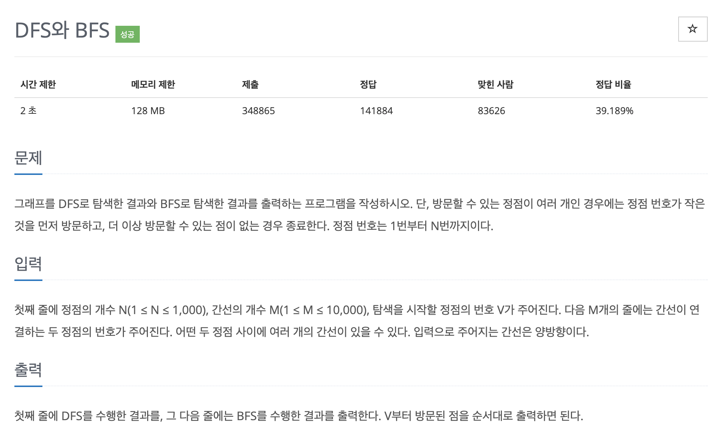

# 문제 029. DFS와 BFS 프로그램



### 문제집 풀이

```java
메모리 40556KB, 시간 524ms

public class P1260_DFS와BFS {

	static boolean[] visited;
	static ArrayList<Integer>[] A;

	public static void main(String[] args) throws IOException {
		Scanner sc = new Scanner(System.in);

		int N = sc.nextInt();	// 노드 개수
		int M = sc.nextInt();	// 에지 개수
		int start = sc.nextInt();	// 시작점

		A = new ArrayList [N+1];
		for(int i=1; i<=N; i++) {
			A[i] = new ArrayList<Integer>();
		}

		for(int i=0; i<M; i++) {
			int S = sc.nextInt();
			int E = sc.nextInt();

			A[S].add(E);
			A[E].add(S);
		}

		// 번호가 작은 것부터 먼저 방문하기 위해 정렬하기
		for(int i=1; i<=N; i++) {
			Collections.sort(A[i]);
		}

		visited = new boolean [N+1];	// 방문 배열 초기화
		DFS(start);
		System.out.println();

		visited = new boolean [N+1];	// 방문 배열 초기화
		BFS(start);
	}

	private static void DFS(int node) {
		System.out.print(node + " ");
		visited[node] = true;

		for(int i : A[node]) {
			if(!visited[i]) {
				DFS(i);
			}
		}
	}

	private static void BFS(int node) {
		Queue<Integer> queue = new LinkedList<Integer>();
		queue.add(node);
		visited[node] = true;

		while(!queue.isEmpty()) {
			int now_Node = queue.poll();
			System.out.print(now_Node + " ");

			for(int i : A[now_Node]) {
				if(!visited[i]) {
					visited[i] = true;
					queue.add(i);
				}
			}
		}
	}

}
```
