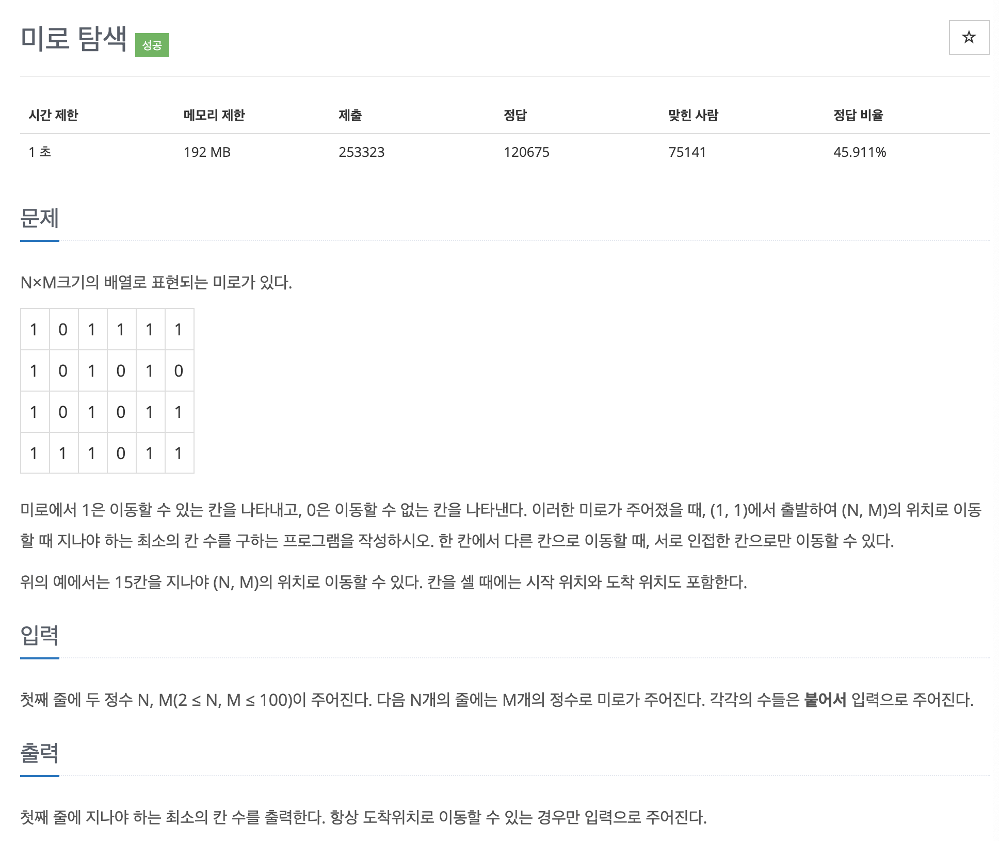

# 문제 030. 미로 탐색하기



### 문제집 풀이

```java
메모리 15804KB, 시간 136ms

public class P2178_미로탐색 {

	// 상하좌우를 탐색하기 위한 배열 선언
	static int[] dx = {0, 1, 0, -1};
	static int[] dy = {1, 0, -1, 0};

	static boolean[][] visited;
	static int[][] A;
	static int N, M;

	public static void main(String[] args) throws IOException {
		BufferedReader br = new BufferedReader(new InputStreamReader(System.in));
		StringTokenizer st = new StringTokenizer(br.readLine());
		N = Integer.parseInt(st.nextToken());
		M = Integer.parseInt(st.nextToken());

		A = new int [N][M];
		for(int i=0; i<N; i++) {
			st = new StringTokenizer(br.readLine());
			String line = st.nextToken();
			for(int j=0; j<M; j++) {
				A[i][j] = Integer.parseInt(line.substring(j, j+1));
			}
		}

		visited = new boolean [N][M];
		BFS(0, 0);

		System.out.println(A[N-1][M-1]);
	}

	private static void BFS(int i, int j) {
		Queue<int[]> queue = new LinkedList<>();
		queue.offer(new int[] {i, j});
		visited[i][j] = true;

		while(!queue.isEmpty()) {
			int[] now = queue.poll();
			for(int k=0; k<4; k++) {
				int x = now[0] + dx[k];
				int y = now[1] + dy[k];

				if(x >= 0 && y >= 0 && x < N && y < M) {	// 좌표 유효성 검사
					if(A[x][y] != 0 && !visited[x][y]) {	// 갈 수 있는 칸 & 방문 검사
						visited[x][y] = true;
						A[x][y] = A[now[0]][now[1]] + 1;	// 깊이 업데이트
						queue.add(new int[] {x, y});
					}
				}
			}
		}
	}
}
```
