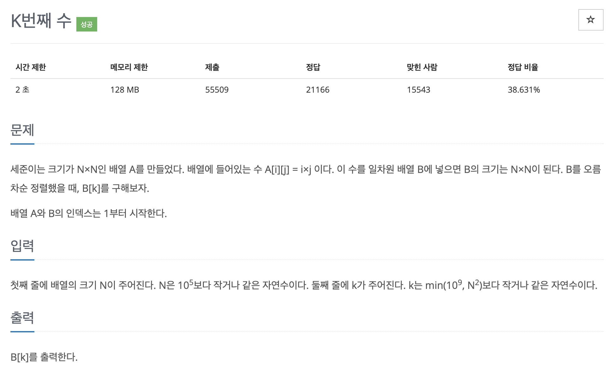

# 문제 034. 배열에서 K번째 수 찾기



### 문제 분석

- k의 범위가 1 ~ $min(10^9, N^2)$ 이므로 시간 복잡도가 $N^2$인 알고리즘은 사용할 수 없고, 여기서는 이진탐색을 사용해야 한다.
- 이진 탐색으로 중앙값보다 작은 수의 개수를 세면서 범위를 절반씩 줄이는 방법으로 B[k] 값을 구한다.
- 다시 말해 작은 수의 개수가 k-1개인 중앙값이 정답이다.

### 문제 풀이

- 2차원 배열은 N행이 N의 배수로 구성되어 있으므로 2차원 배열에서의 k번째 수는 k를 넘지 않는다. 다시 말해 2차원 배열의 1~k번째 안에 정답이 있다.  
  이점에 주목하여 이진 탐색의 시작 인덱스를 1, 종료 인덱스를 k로 정한다.
- 각 행에서 중앙값보다 작거나 같은 수의 개수는 중앙값을 각 행의 첫 번째 값으로 나눈 값이다. 단, 나눈 값이 N보다 크면 N으로 정한다.
  이를 통해 중앙값이 최대 몇 번째 숫자인지를 구할 수 있다.
- 정리하면 중앙값보다 작은 수의 개수가 k보다 작으면 시작 인덱스를 중앙값 + 1, 중앙값보다 작은 수의 개수가 k보다 크거나 같으면 종료 인덱스를 중앙값 - 1로 하면서 정답을 중앙값으로 업데이트하며 시작 인덱스가 종료 인덱스보다 커질 때까지 이진탐색을 진행한다.

### 문제집 풀이

```java
메모리 17752KB, 시간 216ms

public class P1300_K번째수 {

	public static void main(String[] args) {
		Scanner sc = new Scanner(System.in);
		int N = sc.nextInt();
		int K = sc.nextInt();

		long start = 1, end = K;
		long ans = 0;

		// 이진탐색
		while(start <= end) {
			long middle = (start + end) / 2;
			long cnt = 0;

			// 중앙값보다 작은 수는 몇 개인지 계산
			for(int i=1; i<=N; i++) {
				cnt += Math.min(middle/i, N);	// 중앙값을 각 행의 첫번째 값으로 나누기 (단, 나눈 값이 N보다 크면 N으로 설정)
			}

			// 중앙값보다 작은 수의 개수가 K보다 작으면 '시작 인덱스 = 중앙값 + 1'
			// 중앙값보다 작은 수의 개수가 K보다 크거나 같으면 '종료 인덱스 = 중앙값 - 1, 정답 변수 = 중앙값'
			if(cnt < K) {
				start = middle + 1;
			} else {
				ans = middle;		// 현재 단계의 중앙값을 정답 변수에 저장
				end = middle - 1;
			}
		}

		System.out.println(ans);
	}
}
```
