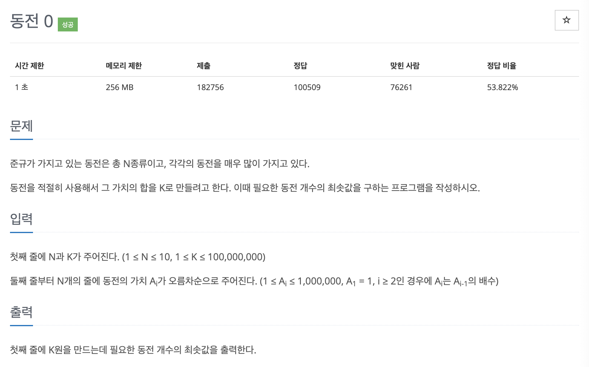

# 문제 035. 동전 개수의 최솟값 구하기



### 내가 작성한 풀이

```java
메모리 14292KB, 시간 104ms

public class P11047_동전개수최솟값 {

	public static void main(String[] args) throws IOException {
		BufferedReader br = new BufferedReader(new InputStreamReader(System.in));
		StringTokenizer st = new StringTokenizer(br.readLine());
		int N = Integer.parseInt(st.nextToken());	// 동전 종류 개수
		int K = Integer.parseInt(st.nextToken());	// 만들어야 하는 가치의 합

		int[] coins = new int [N];		// 동전의 가치를 저장한 배열
		for(int i=0; i<N; i++) {
			coins[i] = Integer.parseInt(br.readLine());
		}

		int quantity = 0;	// 동전 개수 수량
		for(int i=N-1; i>=0; i--) {
			quantity += (K / coins[i]);
			K = K % coins[i];
		}

		System.out.println(quantity);
	}
}
```

### 문제 분석

전형적인 그리디 알고리즘 문제로, 그리디 알고리즘으로 풀 수 있도록 뒤의 동전 가격 $A_i$가 앞에 나오는 동전 가격 $A_{i-1}$의 배수가 된다는 조건을 부여했다.  
즉, 동전을 최소로 사용하여 K를 만들기 위해서는 가장 가격이 큰 동전부터 차례대로 사용하면 된다.

### 문제집 풀이

```java
메모리 17744KB, 시간 168ms

public class P11047_동전개수최솟값 {
	public static void main(String[] args) {
		Scanner sc = new Scanner(System.in);

		int N = sc.nextInt();
		int K = sc.nextInt();
		int[] A = new int [N];
		for(int i=0; i<N; i++) {
			A[i] = sc.nextInt();
		}

		int count = 0;
		for(int i=N-1; i>=0; i--) {
			if(A[i] <= K) {			// 현재 동전의 가치가 K보다 작거나 같으면 구성에 추가
				count += K / A[i];
				K = K % A[i];		// K를 현재 동전을 사용하고 남은 금액으로 갱신
			}
		}

		System.out.println(count);
	}
}
```
