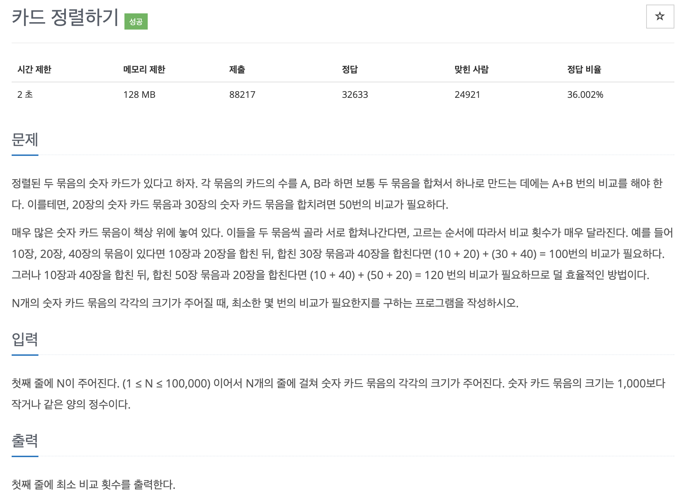

# 문제 036. 카드 정렬하기



### 내가 작성한 풀이 (오답)

```java
public class P1715_카드정렬하기 {

	public static void main(String[] args) throws IOException {
		BufferedReader br = new BufferedReader(new InputStreamReader(System.in));
		int N = Integer.parseInt(br.readLine());	// 숫자 카드 묶음 수

		int[] cards = new int [N];		// 숫자 카드 묶음의 크기 저장
		for(int i=0; i<N; i++) {
			cards[i] = Integer.parseInt(br.readLine());
		}
		Arrays.sort(cards);		// 오름차순 정렬

		long total = 0;
		long count = cards[0];
		for(int i=1; i<N; i++) {
			count += cards[i];
			total += count;
		}

		System.out.println(total);
	}
}

```

### 문제 분석

먼저 선택된 카드 묶음이 비교 횟수에 더 많은 영향을 미친다. 따라서 카드 묶음의 카드의 개수가 작은 순서대로 먼저 합치는 것이 전체 비교 횟수를 줄일 수 있는 방법이다.  
현재 데이터 중 가장 작은 카드의 개수를 가진 묶음 2개를 뽑아야 하고, 이 2개를 기준으로 합친 새로운 카드 묶음을 다시 데이터에 넣고 정렬해야 한다.  
즉, 데이터의 삽입, 삭제, 정렬이 자주 일어난다는 뜻이다. 따라서 이 문제는 우선순위 큐를 이용해야 한다.

### 문제집 풀이

```java
메모리 115812KB, 시간 848ms

public class P1715_카드정렬하기 {

	public static void main(String[] args) {
		Scanner sc = new Scanner(System.in);
		int N = sc.nextInt();	// 카드 묶음의 수 저장

		PriorityQueue<Integer> pq = new PriorityQueue<>();
		for(int i=0; i<N; i++) {
			int data = sc.nextInt();
			pq.add(data);
		}

		int data1 = 0;
		int data2 = 0;
		int sum = 0;
		while(pq.size() != 1) {
			data1 = pq.remove();
			data2 = pq.remove();
			sum += data1 + data2;
			pq.add(data1 + data2);
		}

		System.out.println(sum);
	}
}
```
