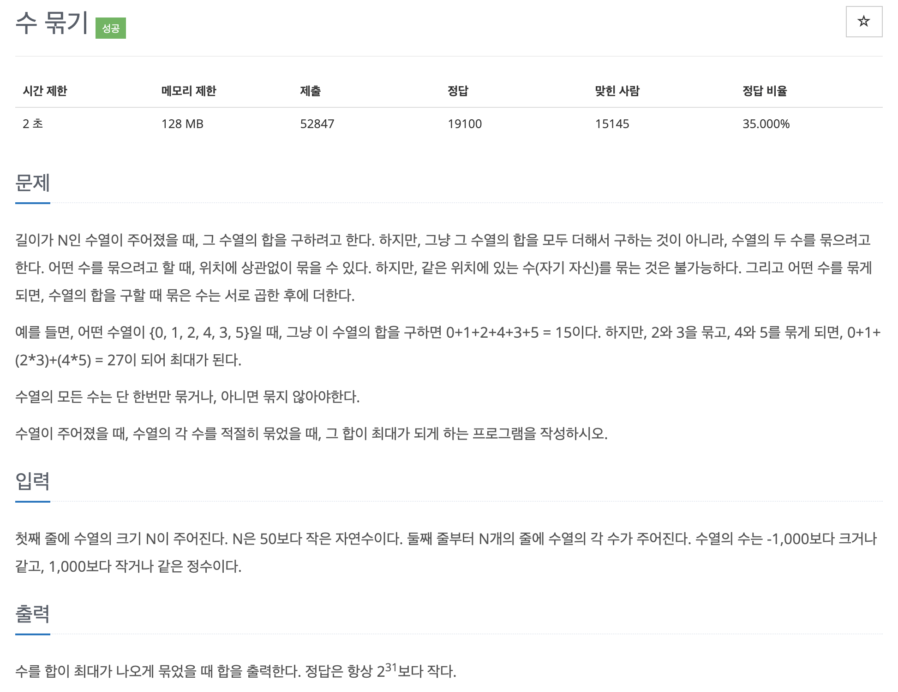

# 문제 037. 수를 묶어서 최댓값 만들기



### 내가 작성한 풀이

```java
메모리 17840KB, 시간 176ms

public class P1744_수묶기 {

	public static void main(String[] args) {
		Scanner sc = new Scanner(System.in);
		int N = sc.nextInt();	// 수열의 크기

		PriorityQueue<Integer> plus = new PriorityQueue<>(Collections.reverseOrder());	// 양수 저장
		PriorityQueue<Integer> minus = new PriorityQueue<>();	// 음수 저장
		int zero = 0;	// 수열에 0이 있는 개수
		int one = 0;	// 수열에 1이 있는 개수

		for(int i=0; i<N; i++) {
			int num = sc.nextInt();

			if(num == 0) {
				zero++;
			} else if (num == 1) {
				one++;
			} else if (num > 0) {
				plus.add(num);
			} else if (num < 0) {
				minus.add(num);
			}
		}

		int sum = 0;

		// 양수처리
		while (!plus.isEmpty()) {
			// 양수끼리는 곱한 후 더하는게 항상 숫자가 더 큼
			if(plus.size() >= 2) {
				int num1 = plus.poll();
				int num2 = plus.poll();

				sum += (num1 * num2);
			} else {
				sum += plus.poll();
			}
		}

		// 음수처리
		while(!minus.isEmpty()) {
			// 음수가 2개 이상 있을 때는 곱해서 양수를 만든 후 더하기
			if(minus.size() >= 2) {
				int num1 = minus.poll();
				int num2 = minus.poll();

				sum += (num1 * num2);
				continue;
			}

			// 음수가 2개 미만으로 남아있을 때는 0이랑 곱해서 0으로 만들 수 있는지 확인
			if(zero > 0) {
				minus.poll();
				zero--;
			} else {
				sum += minus.poll();
			}
		}

		// 1 더하기
		sum += one;

		System.out.println(sum);
	}
}
```

### 문제 분석

- N의 최대 범위가 10,000이므로 시간 복잡도와 관련된 제약은 적은 문제이다.
- 가능한 큰 수들끼리 묶어야 결괏값이 커진다.
- 음수끼리 곱하면 양수로 변하는 성질을 고려한다.

### 문제집 풀이

```java
메모리 17688KB, 시간 184ms

public class P1744_수묶기 {

	public static void main(String[] args) {
		Scanner sc = new Scanner(System.in);
		int N = sc.nextInt();

		PriorityQueue<Integer> plusPq = new PriorityQueue<>(Collections.reverseOrder());	// 양수는 내림차순 정렬하기
		PriorityQueue<Integer> minusPq = new PriorityQueue<>();
		int one = 0;
		int zero = 0;

		// 4개의 그룹으로 분리해 저장하기
		for(int i=0; i<N; i++) {
			int data = sc.nextInt();

			if(data > 1) {
				plusPq.add(data);
			} else if (data == 1) {
				one++;
			} else if (data == 0) {
				zero++;
			} else {
				minusPq.add(data);
			}
		}

		int sum = 0;

		// 양수 처리하기
		while(plusPq.size() > 1) {
			int first = plusPq.remove();
			int second = plusPq.remove();
			sum = sum + first * second;
		}

		if(!plusPq.isEmpty()) {
			sum = sum + plusPq.remove();
		}

		// 음수 처리하기
		while(minusPq.size() > 1) {
			int first = minusPq.remove();
			int second = minusPq.remove();
			sum = sum + first * second;
		}

		if(!minusPq.isEmpty()) {
			if (zero == 0) {
				sum = sum + minusPq.remove();
			}
		}

		// 1 처리하기
		sum = sum + one;
		System.out.println(sum);
	}
}
```
