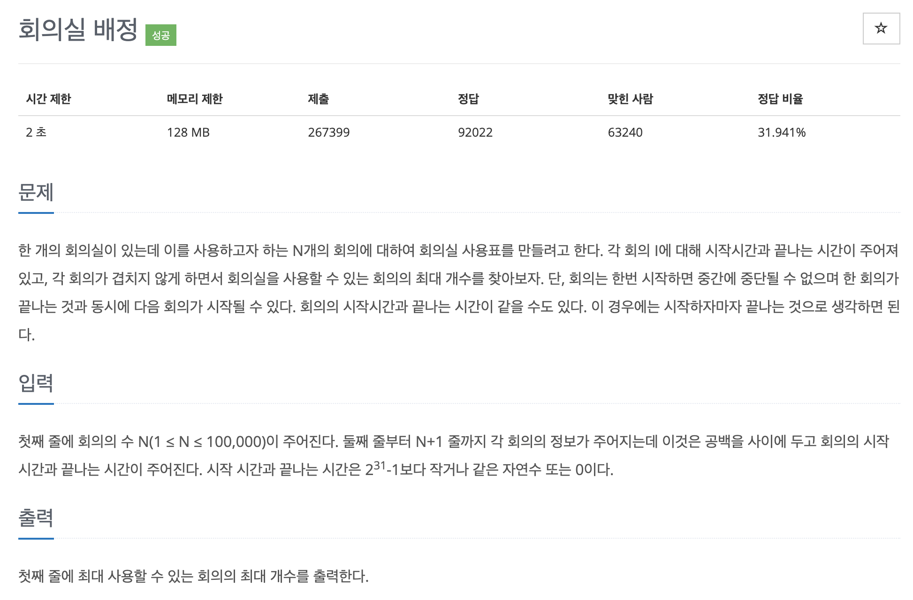

# 문제 038. 회의실 배정하기



### 내가 작성한 풀이

```java
메모리 41852KB, 시간 424ms

class Meeting implements Comparable<Meeting> {
	int start;
	int end;

	public Meeting(int start, int end) {
		this.start = start;
		this.end = end;
	}

	@Override
	public int compareTo(Meeting o) {
		if(this.end == o.end) {
			return this.start - o.start;
		}

		// 회의가 끝나는 시간 기준으로 오름차순 정렬
		return this.end - o.end;
	}
}

public class P1931_회의실배정 {

	public static void main(String[] args) throws IOException {
		BufferedReader br = new BufferedReader(new InputStreamReader(System.in));
		StringTokenizer st;

		int N = Integer.parseInt(br.readLine());	// 회의 개수

		PriorityQueue<Meeting> pq = new PriorityQueue<Meeting>();
		for(int i=0; i<N; i++) {
			st = new StringTokenizer(br.readLine());
			int start = Integer.parseInt(st.nextToken());
			int end = Integer.parseInt(st.nextToken());

			pq.add(new Meeting(start, end));	// 회의가 빨리 끝나는 시간을 기준으로 저장
		}

		int count = 0;	// 회의실을 사용할 수 있는 회의 개수
		int time = 0;	// 회의가 끝나는 시간 저장

		while(!pq.isEmpty()) {
			Meeting meeting = pq.remove();

			// 회의 시작 시간이 이전 회의가 끝나는 시간보다 빠를 경우 pass
			if(meeting.start < time) {
				continue;
			}

			time = meeting.end;
			count++;
		}

		System.out.println(count);
	}
}
```

### 문제집 풀이

```java
시간 174504KB, 시간 1048ms

public class P1931_회의실배정 {

	public static void main(String[] args) {
		Scanner sc = new Scanner(System.in);
		int N = sc.nextInt();

		int[][] A = new int [N][2];
		for(int i=0; i<N; i++) {
			A[i][0] = sc.nextInt();
			A[i][1] = sc.nextInt();
		}
		Arrays.sort(A, new Comparator<int[]>() {

			@Override
			public int compare(int[] S, int[] E) {
				// 종료 시간이 같을
				if(S[1] == E[1]) {
					return S[0] - E[0];
				}

				return S[1] - E[1];
			}
		});

		int count = 0;
		int end = -1;

		for(int i=0; i<N; i++) {
			if(A[i][0] >= end) {	// 겹치지 않는 다음 회의가 나온 경우
				end = A[i][1];		// 종료 시간 업데이트하기
				count++;
			}
		}

		System.out.println(count);
	}
}
```
