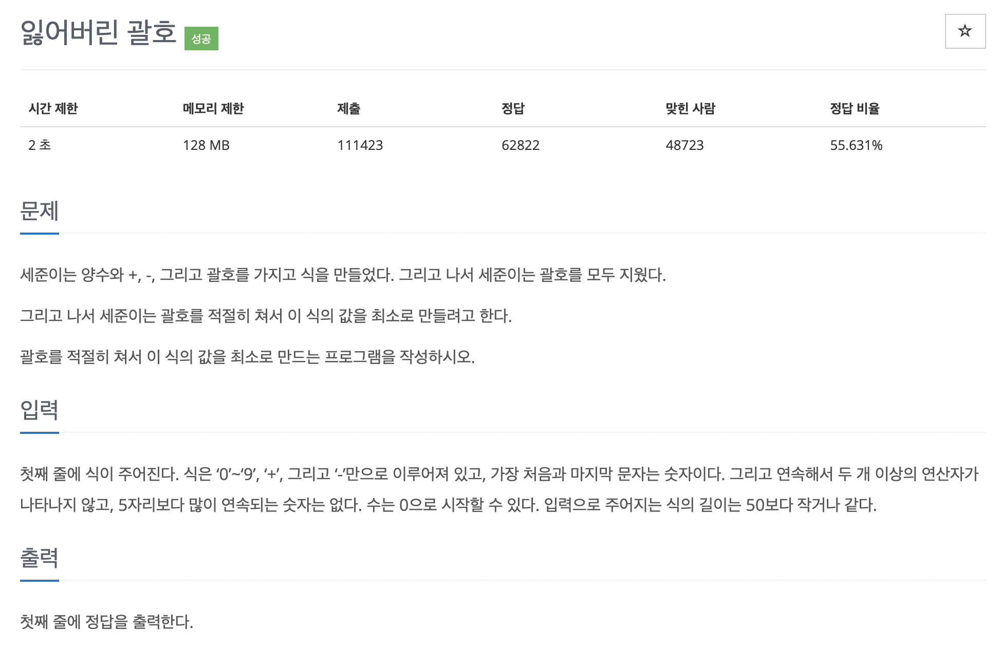

# 문제 039. 최솟값을 만드는 괄호 배치 찾기



### 내가 작성한 풀이

```java
메모리 17640KB, 시간 164ms

public class P1541_잃어버린괄호 {

	public static void main(String[] args) {
		Scanner sc = new Scanner(System.in);

		String s = sc.next();
		String[] splitMinus = s.split("-");		// '-' 기준으로 분리

		for(int i=0; i<splitMinus.length; i++) {
			// '+'가 있으면 괄호를 친다고 생각하고 먼저 더하기
			if(splitMinus[i].contains("+")) {
				String[] splitPlus = splitMinus[i].split("\\+");	// '+' 기준으로 분리

				int num = 0;
				for(int j=0; j<splitPlus.length; j++) {
					num += Integer.parseInt(splitPlus[j]);
				}

				splitMinus[i] = String.valueOf(num);	// 더한 값을 기존 배열에 넣기
			}
		}

		int num = Integer.parseInt(splitMinus[0]);
		for(int i=1; i<splitMinus.length; i++) {
			num -= Integer.parseInt(splitMinus[i]);	// 빼기 진행
		}

		System.out.println(num);
	}
}
```

### 문제집 풀이

```java
메모리 17716KB, 시간 184ms

public class P1541_잃어버린괄호 {

	static int answer = 0;

	public static void main(String[] args) {
		Scanner sc = new Scanner(System.in);
		String example = sc.nextLine();
		String[] str = example.split("-");

		for(int i=0; i<str.length; i++) {
			int temp = mySum(str[i]);

			if(i == 0) {
				answer = answer + temp;		// 가장 앞에 있는 값만 더함
			} else {
				answer = answer - temp;		// 뒷부분은 더한 값들을 뺌
			}
		}

		System.out.println(answer);
	}

	private static int mySum(String a) {	// 나뉜 그룹의 더하기 연산 수행 함수
		int sum = 0;
		String[] temp = a.split("[+]");

		for(int i=0; i<temp.length; i++) {
			sum += Integer.parseInt(temp[i]);
		}

		return sum;
	}
}
```
