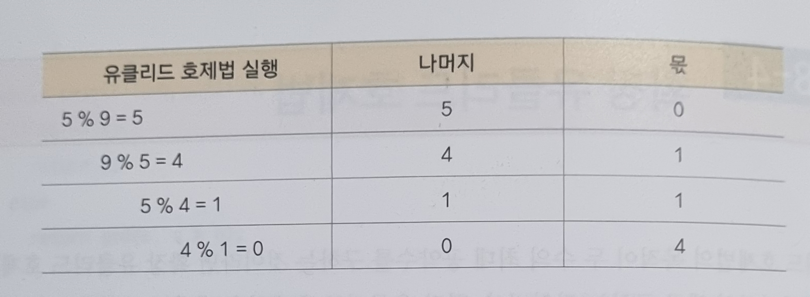
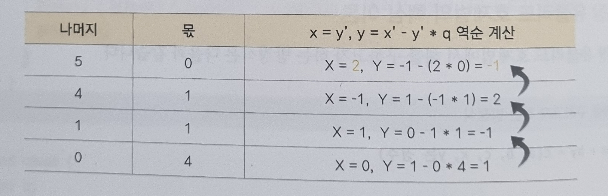

# 08-4. 확장 유클리드 호제법

### 확장 유클리드 호제법

유클리드 호제법의 목적이 두 수의 최대 공약수를 구하는 것이라면 확장 유클리드 호제법의 목적은 방정식의 해를 구하는 것이다.

 

### 핵심 이론

해를 구하고자 하는 방정식이 $ax + by = c$ (a, b, c, x, y는 정수) 일 때, c가 a와 b의 최대 공약수의 배수인 경우에만 정수해를 가진다.  
이는 $ax + by = c$가 정수해를 갖게 하는 c의 최솟값이 gcd(a, b)라는 것을 의미한다.

 

### 확장 유클리드 호제법의 원리 이해하기

$5x + 9y = 2$ 일 때, 이 식을 만족하는 정수 x, y 구하기

1. 우선 $5x + 9y$ 가 정수해를 갖게 하는 c의 최솟값이 gcd(5, 9)라는 것을 적용하여 식을 다시 세운다.  
   gcd(5, 9) = 1 이므로 $5x + 9y = 1$로 식을 다시 놓고 다음 단계를 진행한다.

2. a, b로 유클리드 호제법을 반복 실행하며 몫, 나머지를 저장한다. 반복은 나머지가 0이 되면 중단한다.  
   

3. 반복으로 구한 나머지와 몫을 이용하여 거꾸로 올라가며 $x = y' , y = x' - y' * q$ 를 계산한다. $x'$ 는 이전 $x, y'$는 이전 y를 의미하고, q는 현재 보고 있는 몫을 의미한다.  
   이때 처음 시작하는 x, y는 이전 x와 이전 y가 없으므로 각각 1, 0으로 지정하여 역계산을 진행한다.
   
4. 이렇게 재귀 방식으로 알아낸 최종 x, y는 $ax + by = gcd(a, b)$를 만족한다. 그리고 $c / gcd(a, b) = K$를 가정하면 최초 방정식의 해는 Kx, Ky로 간단히 구할 수 있다.  
   과정3에서 찾은 x는 2, y는 -1이므로 2/1 = 2이며, 2*2, 2*-1에 의해 최초 방정식의 해는 4, -2가 된다.

 

#### 오른쪽 변의 값이 gcd(a, b)의 배수가 아니라면?

결론적으로 이 경우를 만족하는 x, y 값은 정수 범위에서 존재하지 않는다. 따라서 확장 유클리드 호제법을 구현할 때 먼저 오른쪽 변의 값이 gcd(a, b)의 배수라는 조건을 만족하는지 먼저 판단해야 한다. 만약 조건을 만족하지 않는다면 이후 프로그램을 수행하지 않고 불가능을 표현하는 값을 출력하면 된다.

 

### 예제 문제

- [문제 048. Ax + By = C](./문제048.%20Ax+By=C.md)
