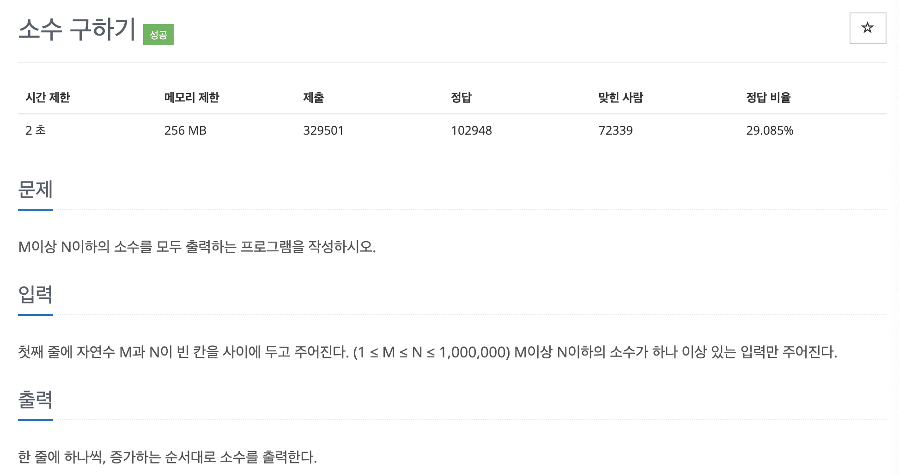

# 문제 040. 소수 구하기



### 내가 작성한 풀이

```java
메모리 26860KB, 시간 344ms

public class P1929_소수구하기 {

	public static void main(String[] args) throws IOException {
		Scanner sc = new Scanner(System.in);
		BufferedWriter bw = new BufferedWriter(new OutputStreamWriter(System.out));

		int M = sc.nextInt();
		int N = sc.nextInt();

		boolean[] prime = new boolean [N+1];	// 소수라면 true, 아니면 false로 관리
		for(int i=2; i<=N; i++) {
			prime[i] = true;
		}

		for(int i=2; i<=N; i++) {
			// 이미 소수가 아니라고 판별된 숫자는 제외
			if(!prime[i]) {
				continue;
			}

			// i의 배수를 계산하면서 해당 숫자는 소수가 아니라고 판단
			for(int j=2; j<=N; j++) {
				if(i * j > N) {		// 곱한 값이 N보다 크다면 더 이상 배수를 계산할 필요가 없음
					break;          // -> 아래 추가 내용 참고
				}

				prime[i*j] = false;
			}
		}

		// 소수 출력
		for(int i=M; i<=N; i++) {
			if(prime[i]) {
				bw.write(i+"\n");
			}
		}

		bw.flush();
		bw.close();
	}
}
```

**추가 내용**

처음에는 `if(i*j > N) coninue;`로 코드를 작성했는데 ArrayIndexOutOfBounds 에러가 발생했다. 이후 위와 같이 `break`로 코드를 수정하니 정상 동작되었다.  
둘 다 N보다 범위가 크면 `prime[i*j] = false;` 코드가 동작하지 않도록 구현했는데 왜 ArrayIndexOutOfBounds 에러가 발생했을까 고민해보았다.  
`i*j` 값이 계속 커지면 int의 범위를 벗어나게 되고, int의 범위가 벗어난 `i*j`는 음수와 같이 예상할 수 없는 값으로 변경될 수 있다. 따라서 N의 크기보다는 작지만, 배열 인덱스에는 해당하지 않는 값으로 변경될 수 있다. 하지만 `break`는 N보다 숫자가 커지게 되면 아예 이후 곱셈 과정을 중지시켜서 int 범위 이상이 되는 숫자가 나올 가능성이 없앨 수 있기 떄문에 문제 없이 동작된다.

<br />

### 문제집 풀이

```java
메모리 37108KB, 시간 744ms

public class P1929_소수구하기 {

	public static void main(String[] args) {
		Scanner sc = new Scanner(System.in);
		int M = sc.nextInt();
		int N = sc.nextInt();
		int[] A = new int [N+1];
		for(int i=2; i<=N; i++) {
			A[i] = i;
		}

		/*
		 	< 제곱근까지만 탐색하는 이유 >
		 	N이 a*b라고 가정했을 때, a와 b 둘이 동시에 N의 제곱근보다 클 수는 없다.
		 	따라서 N의 제곱근까지만 확인해도 전체 범위의 소수르 판별할 수 있다.
		 */
		for(int i=2; i<=Math.sqrt(N); i++) {	// 제곱근까지만 수행
			if(A[i] == 0) {
				continue;
			}

			for(int j=i+i; j<=N; j=j+i) {	// 배수 지우기
				A[j] = 0;
			}
		}

		for(int i=M; i<=N; i++) {
			if(A[i] != 0) {
				System.out.println(A[i]);
			}
		}
	}
}
```
