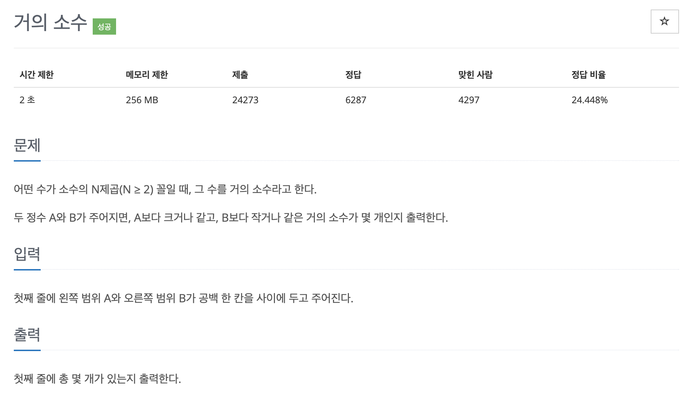

# 문제 041. 거의 소수 구하기



### 내가 작성한 풀이 (오답)

```java
InputMismatch 에러 발생
- A, B의 범위가 int 범위를 벗어날 수 있음. 따라서 long으로 타입을 변경해야 하는데 변경하면 소수판별 배열(prime)의 크기를 어떻게 설정해야 할 지 모르겠다.

public class P1456_거의소수 {

	public static void main(String[] args) {
		Scanner sc = new Scanner(System.in);
		int A = sc.nextInt();
		int B = sc.nextInt();	// A보다 크거나 같고, B보다 작거나 같은 거의 소수가 몇 개인지 출력

		// 소수 판별
		boolean[] prime = new boolean [B+1];	// 해당 인덱스 값이 소수면 true, 소수가 아니라면 false 저장
		for(int i=2; i<=B; i++) {
			prime[i] = true;			// 우선 모든 수가 소수라고 가정 (0과 1 제외)
		}

		for(int i=2; i<=B; i++) {
			if(!prime[i]) {		// 이미 소수가 아니라고 판단된 값은 pass
				continue;
			}

			for(int j=2; j<=B; j++) {
				if(i*j > B) {	// i*j의 값이 B의 범위를 벗어났다면 이후 탐색 종료
					break;
				}

				prime[i*j] = false;		// 소수의 배수라면 소수가 아니므로 false
			}
		}

		// 소수의 N제곱 개수 구하기
		HashSet<Double> set = new HashSet<Double>();	// 중복을 허용하지 않기 때문에 set 자료구조 사용

		for(int i=2; i<=B; i++) {
			if(!prime[i]) {		// 소수의 제곱을 구해야 하므로 소수가 아니라면 pass
				continue;
			}

			for(int j=2; j<=B; j++) {
				double square = Math.pow(i, j);		// 제곱수 구하기

				if(square < A) {	// A보다 작으면 pass, 단 뒤에 탐색은 이어서 진행
					continue;
				}

				if(square > B) {	// B보다 크다면 더 이상 탐색을 진행할 필요가 없음
					break;
				}

				set.add(square);	// 소수의 제곱수 set에 추가 (자동으로 중복은 제거됨)
			}
		}

		System.out.println(set.size());
	}
}
```

### 문제집 풀이

```java
메모리 96052KB, 시간 480ms

public class P1456_거의소수 {

	public static void main(String[] args) {
		Scanner sc = new Scanner(System.in);
		long min = sc.nextLong();
		long max = sc.nextLong();

		long[] A = new long [10000001];		// 10^14의 제곱근인 10^7 중에서 소수 구하기
		for(int i=2; i<A.length; i++) {
			A[i] = i;		// 각각의 인덱스값으로 초기화
		}

		for(int i=2; i<=Math.sqrt(A.length); i++) {		// 제곱근까지만 수행
			if(A[i] == 0) {		// 이미 소수가 아니라고 판별됐으면 pass
				continue;
			}

			for(int j=i+i; j<A.length; j=j+i) {		// 배수 지우기
				A[j] = 0;
			}
		}

		int count = 0;
		for(int i=2; i<10000001; i++) {
			if(A[i] != 0) {
				long temp = A[i];	// 현재 소수

				// N제곱한 값을 구하는 도중에 값의 범위가 long 형을 초과하는 경우가 발생한다.
				// 따라서 계산 오류를 방지하려면 N^k과 B값이 아니라 N과 B/N^{k-1}을 비교하는 형식으로 식을 정리해야 한다.
				while((double)A[i] <= (double)max / (double)temp) {
					if((double)A[i] >= (double)min/(double)temp) {
						count++;
					}

					temp = temp * A[i];
				}
			}
		}

		System.out.println(count);
	}
}
```
