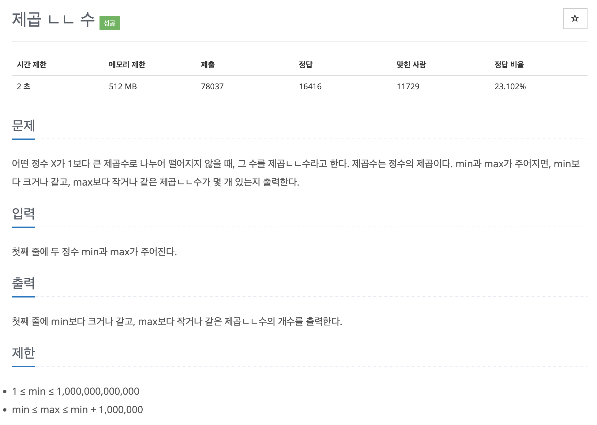

# 문제 043. 제곱이 아닌 수 찾기



### 문제 분석

- min의 최댓값이 1,000,000,000,000으로 매우 큰 것 같지만 실제로는 min과 max 사이의 수들 안에서 구하는 것이므로 1,000,000개의 데이터만 확인하면 된다.
- 제곱수 판별을 일반적인 반복문으로 구하면 시간 초과가 발생하므로 에라토스테네스의 체 알고리즘 방식을 제곱수 판별 로직에 적용해 해결

### 문제집 풀이

```java
메모리 18780KB, 시간 220ms

public class P1016_제곱이아닌수 {

	public static void main(String[] args) {
		Scanner sc = new Scanner(System.in);
		long min = sc.nextLong();
		long max = sc.nextLong();

		// 최댓값과 최솟값의 차이만큼 배열 선언
		boolean[] check = new boolean [(int)(max-min+1)];

		// 2의 제곱수인 4부터 max보다 작거나 같은 값까지 반복
		for(long i=2; i*i <= max; i++) {		// 제곱수 형태로 증가
			long pow = i * i;	// 제곱수
			long start_index = min / pow;

			if(min % pow != 0) {
				start_index++;		// 나머지가 있으면 1을 더해야 min보다 큰 제곱수에서 시작됨
			}

			// j*pow가 max보다 작을 때 최솟값, 최댓값 사이의 제곱수이므로 check 배열에 저장
			for(long j=start_index; pow * j <= max; j++) {
				check[(int)((j*pow) - min)] = true;		// 제곱수를 true로 변경
			}
		}

		int count = 0;
		for(int i=0; i<=max-min; i++) {
			if(!check[i]) {
				count++;
			}
		}

		System.out.println(count);
	}
}
```
