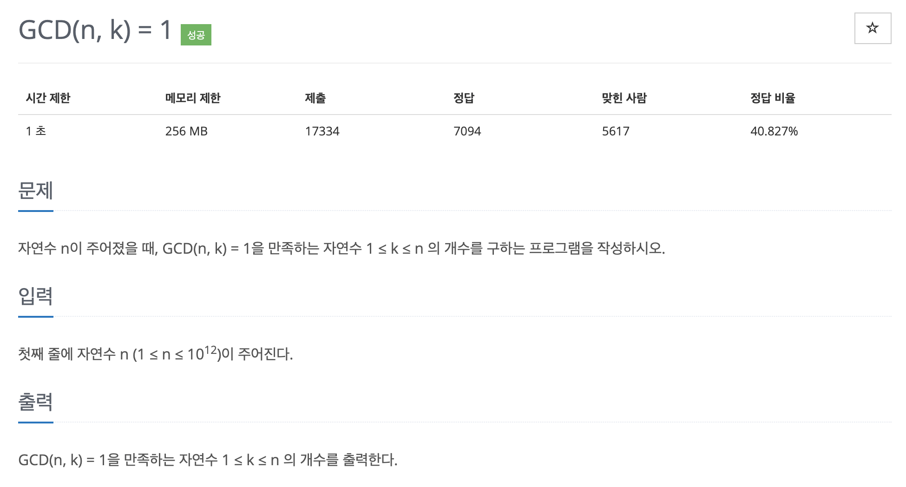

# 문제 044. 오일러 피 함수 구현하기



### 문제 분석

- 문제에서 요구하는 $GCD(n, k) = 1$을 만족하는 자연수의 개수가 오일러 피 함수의 정의이다.

### 문제집 풀이

```java
메모리 14272KB, 시간 116ms

public class P11689_GCDNK1 {

	public static void main(String[] args) throws IOException {
		BufferedReader br = new BufferedReader(new InputStreamReader(System.in));

		// 1. 서로소의 개수를 표현하는 변수 result와 현재 소인수 구성을 표시하는 변수 n을 선언
		long n = Long.parseLong(br.readLine());
		long result = n;

		// 2. 2 ~ N의 제곱근까지 탐색하면서 소인수일 때 result = result - (result/소인수) 연산으로 result 값을 업데이트
		//    이때 n에서 이 소인수는 나누기 연산으로 삭제
		for(long p=2; p<=Math.sqrt(n); p++) {		// 제곱근까지만 진행
			if (n % p == 0) {						// p가 소인수인지 확인
				result = result - result/p;			// 결괏값 업데이트
				while(n % p == 0) {					// 2^7*11 이라면 2^7을 없애고 11만 남김
					n /= p;
				}
			}
		}

		// 3. 반복문 종료 후 현재 n이 1보다 크면 n이 마지막 소인수라는 뜻
		//    result = result - (result/n) 연산으로 result 값을 마지막으로 업데이트한 후 출력
		if(n > 1) {			// 아직 소인수 구성이 남아있을 때
			// 반복문에서 제곱근까지만 탐색했으므로 1개의 소인수가 누락되는 케이스
			result = result - result / n;
		}

		System.out.println(result);
	}
}
```
