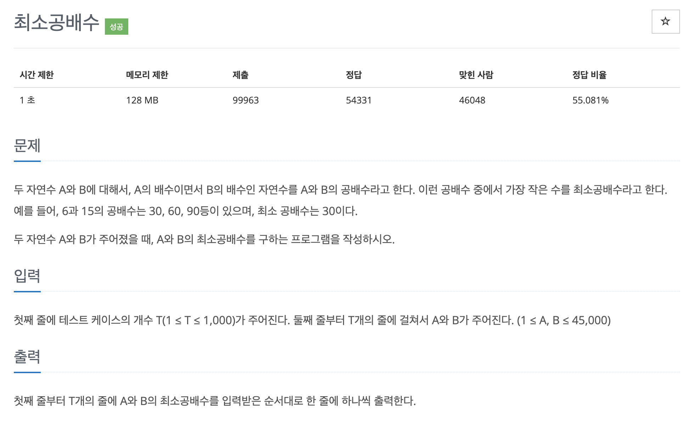

# 문제 045. 최소 공배수 구하기



### 문제 분석

- 최소공배수 = (A \* B) / 최대 공약수

### 내가 작성한 풀이

```java
메모리 15044KB, 시간 140ms

public class P1934_최소공배수 {

	public static void main(String[] args) throws IOException {
		BufferedReader br = new BufferedReader(new InputStreamReader(System.in));
		BufferedWriter bw = new BufferedWriter(new OutputStreamWriter(System.out));
		StringTokenizer st;

		int TC = Integer.parseInt(br.readLine());	// 테스트 케이스 수

		for(int t=0; t<TC; t++) {
			st = new StringTokenizer(br.readLine());
			int A = Integer.parseInt(st.nextToken());
			int B = Integer.parseInt(st.nextToken());

			int big = Math.max(A, B);
			int small = Math.min(A, B);

			// 최대공약수 구하기
			while(big % small != 0) {
				int mod = big % small;
				big = small;
				small = mod;
			}

			// 최대공배수 = (A*B) / 최대공약수
			int answer = (A*B) / small;
			bw.write(answer + "\n");
		}

		bw.flush();
		bw.close();
	}
}
```

### 문제집 풀이

```java
메모리 21404KB, 시간 256ms

public class P1934_최소공배수 {

	public static void main(String[] args) {
		Scanner sc = new Scanner(System.in);
		int t = sc.nextInt();

		for(int i=0; i<t; i++) {
			int a = sc.nextInt();
			int b = sc.nextInt();
			int result = a * b / gcd(a, b);
			System.out.println(result);
		}
	}

	private static int gcd(int a, int b) {
		if (b == 0) {
			return a;
		}

		return gcd(b, a % b);		// 재귀 함수 형태로 구현
	}
}
```
