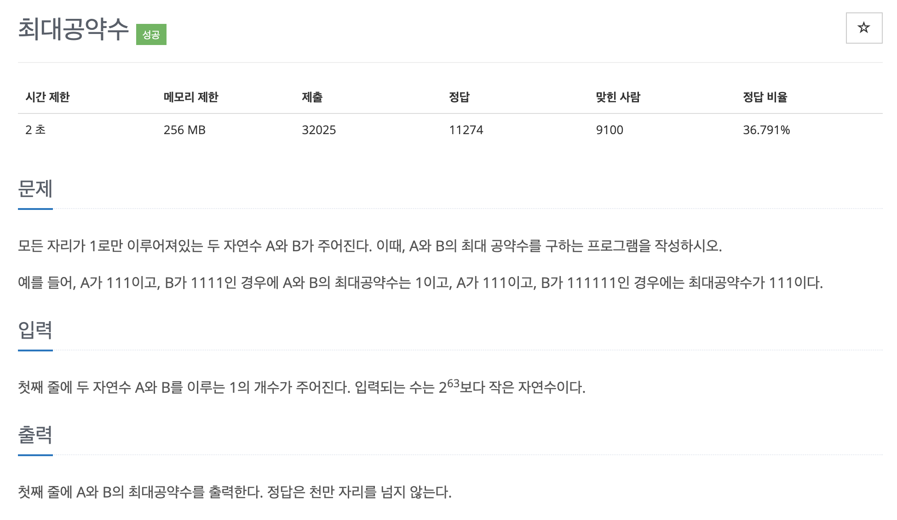

# 문제 046. 최대 공약수 구하기



### 내가 작성한 풀이

```java
메모리 15900KB, 시간 288ms

public class P1850_최대공약수 {

	public static void main(String[] args) throws IOException {
        // Scanner와 System.out.println은 시간 초과 발생해서 수정
		BufferedReader br = new BufferedReader(new InputStreamReader(System.in));
		BufferedWriter bw = new BufferedWriter(new OutputStreamWriter(System.out));

		StringTokenizer st = new StringTokenizer(br.readLine());
		long A = Long.parseLong(st.nextToken());
		long B = Long.parseLong(st.nextToken());

		long oneNum = gcd(Math.max(A, B), Math.min(A, B));	// 최대공약수의 1의 개수 구하기

		// 1의 개수만큼 result에 1을 더해서 최대공약수 구하기
		for(int i=0; i<oneNum; i++) {
			bw.write("1");
		}

		bw.flush();
		bw.close();
	}

	private static long gcd(long a, long b) {
		if(b == 0) {
			return a;
		}

		return gcd(b, a%b);
	}
}
```

### 문제집 풀이

```java
메모리 18436KB, 시간 380ms

public class P1850_최대공약수 {

	public static void main(String[] args) throws IOException {
		Scanner sc = new Scanner(System.in);
		BufferedWriter bw = new BufferedWriter(new OutputStreamWriter(System.out));
		long a = sc.nextLong();
		long b = sc.nextLong();

		long result = gcd(a, b);
		while(result > 0) {
			bw.write("1");
			result--;
		}

		bw.flush();
		bw.close();
	}

	private static long gcd(long a, long b) {
		if (b == 0) {
			return a;
		}

		return gcd(b, a % b);
	}
}
```
