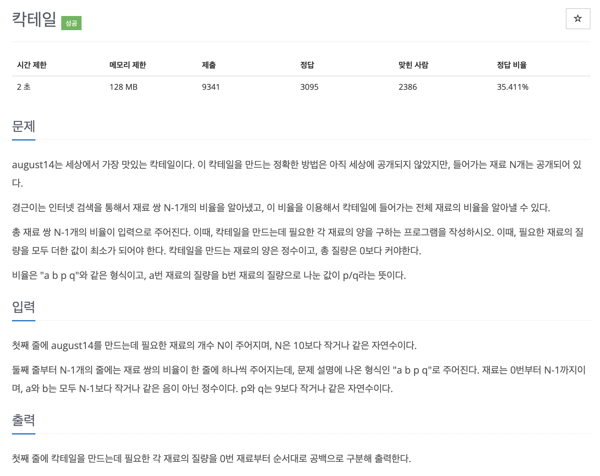

# 문제 047. 칵테일 만들기



### 문제 분석

- 문제에서 N-1개의 비율로 N개의 재료와 관련된 전체 비율을 알아낼 수 있다고 했다. 이것을 그래프 관점으로 생각하면 사이클이 없는 트리 구조로 이해할 수 있다.
- 위의 내용을 바탕으로 임의의 노드에서 DFS를 진행하면서 정답을 찾음
- DFS 과정에서 유클리드 호제법을 사용해 비율들의 최소공배수와 최대공약수를 구하고, 재료의 최소 질량을 구하는 데 사용하여 문제를 해결

### 문제 풀이

1. 인접 리스트를 이용해 각 재료의 비율 자료를 그래프로 구현
2. 데이터를 저장할 때마다 비율과 관련된 수들의 최소 공배수를 업데이트
3. 임의의 시작점에서 최소 공배수 값을 저장
4. 임의의 시작점에서 DFS로 탐색을 수행하면서 각 노드의 값을 이전 노드의 값과의 비율 계산을 통해 계산하고 저장
5. 각 노드의 값을 모든 노드의 최대 공약수로 나눈 뒤 출력

### 문제집 풀이

```java
메모리 18352KB, 시간 192ms

class cNode {
	int b;
	int p;
	int q;

	public cNode(int b, int p, int q) {
		this.b = b;
		this.p = p;
		this.q = q;
	}
}

public class P1033_칵테일 {

	static ArrayList<cNode>[] A;
	static long lcm;
	static boolean[] visited;
	static long[] D;

	public static void main(String[] args) {
		Scanner sc = new Scanner(System.in);

		int N = sc.nextInt();
		A = new ArrayList[N];
		visited = new boolean [N];
		D = new long [N];
		lcm = 1;

		for(int i=0; i<N; i++) {
			A[i] = new ArrayList<cNode>();
		}

		for(int i=0; i<N-1; i++) {
			int a = sc.nextInt();
			int b = sc.nextInt();
			int p = sc.nextInt();
			int q = sc.nextInt();
			A[a].add(new cNode(b, p, q));
			A[b].add(new cNode(a, q, p));
			lcm *= (p * q / gcd(p, q));		// 최소공배수는 두 수의 곱을 최대 공약수로 나눈 것
		}

		D[0] = lcm;
		DFS(0);
		long mgcd = D[0];
		for(int i=1; i<N; i++) {
			mgcd = gcd(mgcd, D[i]);
		}

		for(int i=0; i<N; i++) {
			System.out.print(D[i] / mgcd + " ");
		}
	}

	/**
	 * 최대공약수 함수 구현
	 */
	private static long gcd(long a, long b) {
		if(b == 0) {
			return a;
		}

		return gcd(b, a % b);
	}

	/**
	 * DFS 구현
	 */
	private static void DFS(int Node) {
		visited[Node] = true;

		for(cNode i : A[Node]) {
			int next = i.b;
			if(!visited[next]) {
				D[next] = D[Node] * i.q / i.p;		// 주어진 비율로 다음 노드값 갱신
				DFS(next);
			}
		}
	}
}
```
