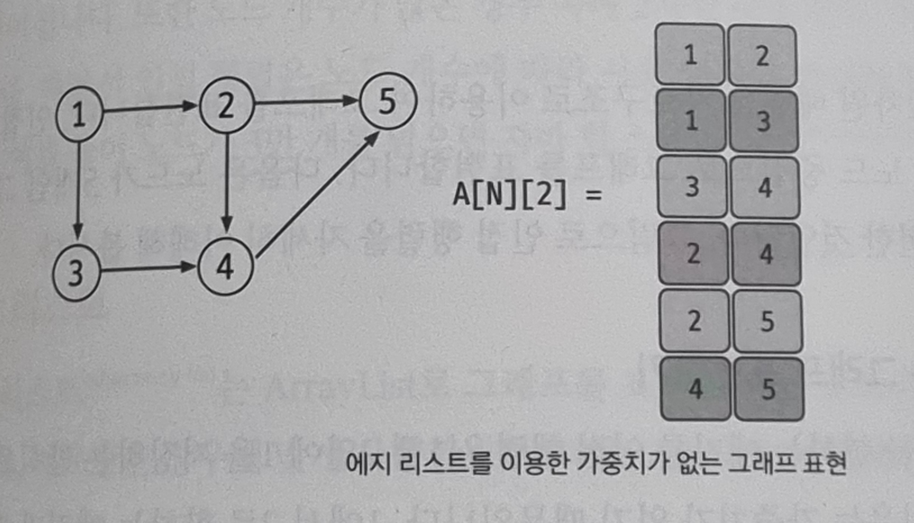
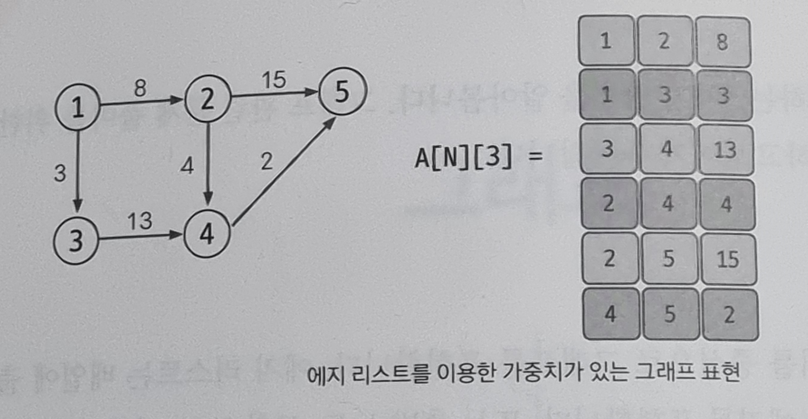
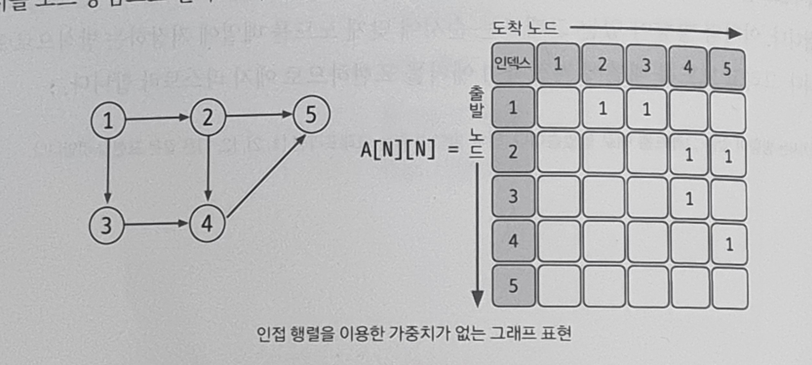
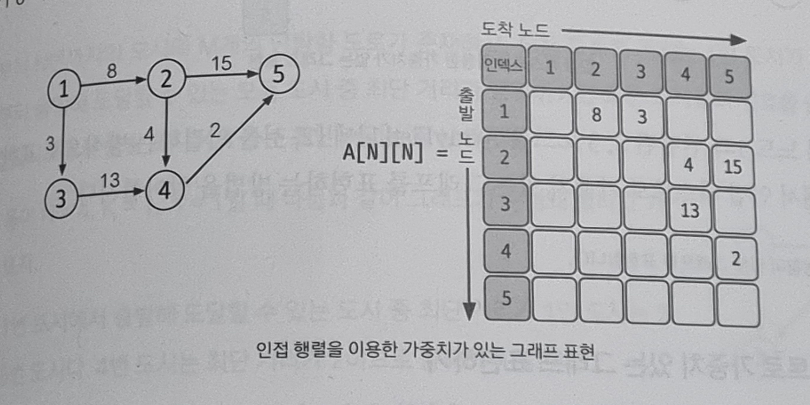
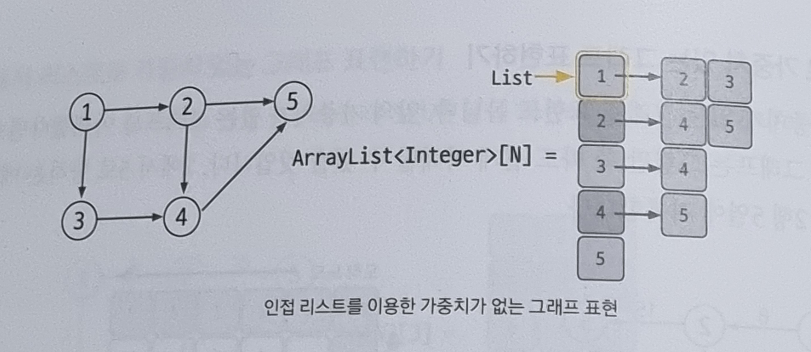
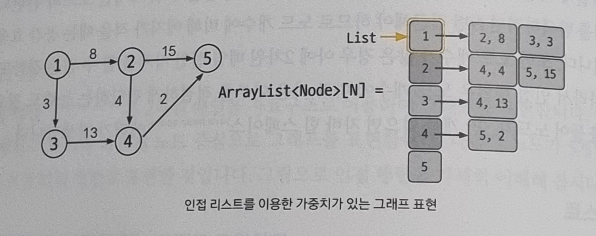

# 09-1. 그래프의 표현

### 에지 리스트 (edge list)

- 에지를 중심으로 그래프를 표현
- 배열에 출발 노드, 도착 노드를 저장하여 에지를 표현 / 또는 출발 노드, 도착 노드, 가중치를 저장하여 가중치가 있는 에지를 표현
- 구현하기 쉽지만, 특정 노드와 관련되어 있는 에지를 탐색하기 쉽지 않다.
- 에지 리스트는 벨만 포드나 크루스칼(MST) 알고리즘에 사용하며, 노드 중심 알고리즘에는 잘 사용하지 않는다.

#### 에지 리스트로 가중치 없는 그래프 표현하기

- 가중치 없는 그래프는 출발 노드와 도착 노드만 표현하므로 배열의 열은 2개면 충분하다.
- 1에서 2로 뻗어나가는 에지는 [1, 2]로 표현한다. 4에서 5로 뻗어나가는 에지는 [4, 5]로 표현한다.  
   → 이처럼 방향이 있는 그래프는 순서에 맞게 노드를 배열에 저장하는 방식으로 표현한다.
- 노드를 배열에 저장하여 에지를 표현하므로 에지 리스트라고 한다.

#### 에지 리스트로 가중치 있는 그래프 표현하기

- 가중치가 있는 그래프는 열을 3개로 늘려 3번째 열에 가중치를 저장하면 된다.
- 1에서 2로 향하는 가중치가 8인 에지는 [1, 2, 8]로 표현한다.

 

### 인접 행렬 (adjacency matrix)

- 2차원 배열은 자료구조를 이용하여 그래프를 표현
- 인접 행렬은 에지 리스트와 다르게 노드 중심으로 그래프를 표현한다.
- 인접 행렬을 이용한 그래프 구현은 쉽고, 두 노드를 연결하는 에지의 여부와 가중치 값은 배열에 접근하면 바로 확인할 수 있다는 장점이 있다.
- 하지만 노드와 관련되어 있는 에지를 탐색하려면 N번 접근해야 하므로 노드 개수에 비해 에지가 적을 때는 공간 효율성이 떨어진다.
- 또한 노드 개수가 많은 경우 아예 2차원 배열 선언 자체를 할 수 없는 결함도 있다.
- 따라서 인접 행렬은 노드 개수에 따라 사용 여부를 적절하게 판단하는 능력이 필요하다.  
  → 예를 들어 노드가 3만 개를 넘으면 자바 힙 스페이스(java heap space) 에러가 발생한다.

#### 인접 행렬로 가중치 없는 그래프 표현하기

- 1에서 2를 향하는 에지를 인접 행렬은 1행 2열에 1을 저장하는 방식으로 표현 (1을 저장하는 이유는 가중치가 없기 때문)
- 1에서 2로 향하는 에지가 있다는 표시를 노드 중심으로 한다고 이해하면 된다.

#### 인접 행렬로 가중치 있는 그래프 표현하기

- 2에서 5로 향하는 에지의 가중치를 2행 5열에 기록한다.

 

### 인접 리스트 (adjacency list)

- ArrayList로 그래프를 표현한다.  
   → 노드의 개수만큼 ArrayList를 선언하고, 자료형은 경우에 맞게 사용
- 그래프를 구현하는 다른 방법에 비해 인접 리스트를 이용한 그래프 구현은 복잡한 편이다.
- 하지만 노드와 연결되어 있는 에지를 탐색하는 시간은 매우 뛰어나며, 노드 개수가 커도 공간 효율이 좋아 메모리 초과 에러도 발생하지 않는다.  
  → 이런 장점으로 코딩 테스트에서는 인접 리스트를 이용한 그래프 구현을 선호한다.

#### 인접 리스트로 가중치 없는 그래프 표현하기

- 현재의 경우 Integer형이면 그래프를 표현하기에 충분하므로 `ArrayList<Integer>[5]`로 선언
- 인접 리스트에는 N번 노드와 연결되어 있는 노드를 배열의 위치 N에 연결된 노드 개수만큼 배열을 연결하는 방식으로 표현
- 예를 들어 노드 1과 연결된 2, 3 노드는 ArrayList[1]에 [2, 3]을 연결하는 방식으로 표현

#### 인접 리스트로 가중치 있는 그래프 표현하기

- 가중치가 있는 경우 자료형을 클래스로 사용한다.
- 위의 이미지는 (도착 노드, 가중치)를 갖는 Node 클래스를 선언하여 ArrayList에 사용한 것이다.
- 이미지를 보면 ArrayList[1]에 [(2, 8), (3, 3)]이 연결되어 있다. 이는 노드 1과 2가 가중치 8 에지로, 노드 1과 3이 가중치 3 에지로 연결되어 있다는 것을 보여준다. (방향성도 고려되어 있음)

 

### 예제 문제

- [문제 049. 특정 거리의 도시 찾기](./문제049.%20특정%20거리의%20도시%20찾기.md)
- [문제 050. 효율적으로 해킹하기](./문제050.%20효율적으로%20해킹하기.md)
- [문제 051. 이분 그래프 판별하기](./문제051.%20이분%20그래프%20판별하기.md)
- [문제 052. 물의 양 구하기](./문제052.%20물의%20양%20구하기.md)
