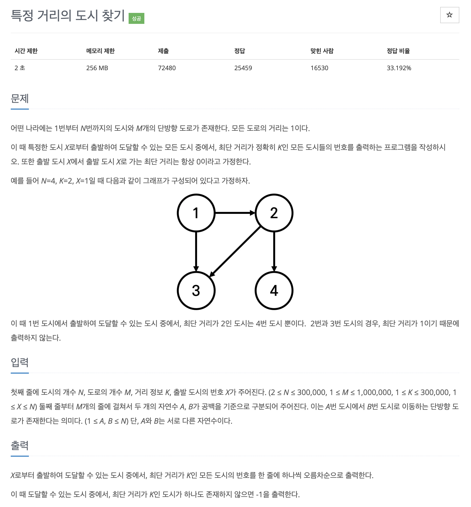

# 문제 049. 특정 거리의 도시 찾기



### 내가 작성한 풀이

```java
메모리 256876KB, 시간 864ms

class Node {
	int edge;
	int depth;

	Node(int edge, int depth) {
		this.edge = edge;
		this.depth = depth;
	}
}

public class P18352_특정거리도시찾기 {

	public static void main(String[] args) throws IOException {
		BufferedReader br = new BufferedReader(new InputStreamReader(System.in));
		StringTokenizer st = new StringTokenizer(br.readLine());

		int n = Integer.parseInt(st.nextToken());	// 도시의 개수
		int m = Integer.parseInt(st.nextToken());	// 도로의 개수
		int k = Integer.parseInt(st.nextToken());	// 거리 정보
		int x = Integer.parseInt(st.nextToken());	// 출발 도시의 번호

		List<Integer>[] adj = new ArrayList [n+1];	// 인접 리스트
		for(int i=0; i<=n; i++) {
			adj[i] = new ArrayList<Integer>();	// 초기화
		}

		// 인접 리스트 세팅
		for(int i=0; i<m; i++) {
			st = new StringTokenizer(br.readLine());
			int a = Integer.parseInt(st.nextToken());
			int b = Integer.parseInt(st.nextToken());

			adj[a].add(b);
		}

		// bfs
		Queue<Node> queue = new LinkedList<Node>();
		boolean[] visited = new boolean [n+1];	// 방문 체크 배열
		List<Integer> answerList = new ArrayList<Integer>();	// 정답 리스트

		// 출발 도시 번호 넣기
		queue.add(new Node(x, 0));
		visited[x] = true;

		while(!queue.isEmpty()) {
			Node now = queue.poll();	// 현재 위치

			// 현재 위치의 거리가 k와 같다면 정답으로 출력, 그 이후는 탐색할 필요 없음
			if(now.depth == k) {
				answerList.add(now.edge);
				continue;
			}

			// 현재 위치와 연결된 도시 순회
			for(int next : adj[now.edge]) {
				if(visited[next]) {		// 이미 방문한 도시는 pass
					continue;
				}

				visited[next] = true;	// 방문체크
				queue.add(new Node(next, now.depth + 1));	// 다음 depth로 설정해서 큐에 넣기
			}
		}

		// 정답 출력
		if(answerList.isEmpty()) {
			System.out.println(-1);		// 도달할 수 있는 도시 중에서, 최단 거리가 k인 도시가 하나도 존재하지 않으면 -1 출력
			return;
		}

		Collections.sort(answerList);
		for(int answer : answerList) {
			System.out.println(answer);
		}
	}
}
```

### 문제집 풀이

```java
메모리 365832KB, 시간 2792ms

public class P18352_특정거리도시찾기 {

	static int[] visited;
	static ArrayList<Integer>[] A;
	static int N, M, K, X;
	static List<Integer> answer;

	public static void main(String[] args) {
		Scanner sc = new Scanner(System.in);
		N = sc.nextInt();	// 노드의 수
		M = sc.nextInt();	// 에지의 개수
		K = sc.nextInt();	// 목표 거리
		X = sc.nextInt();	// 시작점

		A = new ArrayList [N+1];
		answer = new ArrayList<Integer>();
		for(int i=1; i<=N; i++) {
			A[i] = new ArrayList<Integer>();
		}

		for(int i=0; i<M; i++) {
			int S = sc.nextInt();
			int E = sc.nextInt();
			A[S].add(E);
		}

		visited = new int [N+1];	// 방문 배열 초기화
		for(int i=0; i<=N; i++) {
			visited[i] = -1;
		}

		BFS(X);

		for(int i=0; i<=N; i++) {
			if(visited[i] == K) {
				answer.add(i);
			}
		}

		if(answer.isEmpty()) {
			System.out.println("-1");
		} else {
			Collections.sort(answer);
			for(int temp : answer) {
				System.out.println(temp);
			}
		}
	}

	// BFS 구현하기
	private static void BFS(int node) {
		Queue<Integer> queue = new LinkedList<Integer>();
		queue.add(node);
		visited[node]++;

		while(!queue.isEmpty()) {
			int nowNode = queue.poll();
			for(int i : A[nowNode]) {
				if(visited[i] == -1) {
					visited[i] = visited[nowNode] + 1;
					queue.add(i);
				}
			}
		}
	}
}
```
