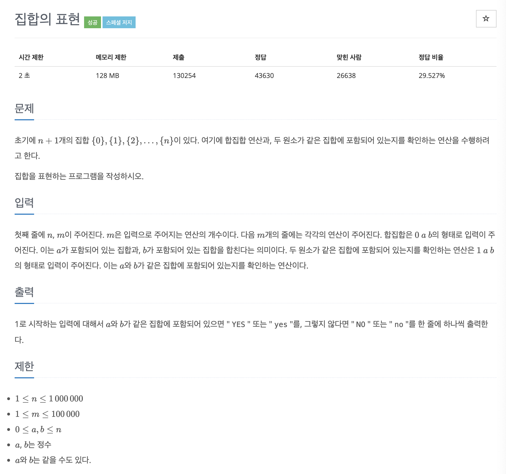

# 문제 053. 집합 표현하기



### 내가 작성한 풀이

```java
메모리 48508KB, 시간 504ms

public class P1717_집합표현하기 {

	static int[] parentNode;

	public static void main(String[] args) throws IOException {
		BufferedReader br = new BufferedReader(new InputStreamReader(System.in));
		BufferedWriter bw = new BufferedWriter(new OutputStreamWriter(System.out));

		StringTokenizer st = new StringTokenizer(br.readLine());
		int N = Integer.parseInt(st.nextToken());	// 0부터 N까지의 N+1개의 집합
		int M = Integer.parseInt(st.nextToken());	// 연산의 개수

		parentNode = new int [N+1];
		for(int i=0; i<=N; i++) {
			parentNode[i] = i;		// 자기 자신을 부모 노드로 세팅
		}

		for(int m=0; m<M; m++) {
			st = new StringTokenizer(br.readLine());
			int type = Integer.parseInt(st.nextToken());
			int a = Integer.parseInt(st.nextToken());
			int b = Integer.parseInt(st.nextToken());

			// a가 포함되어 있는 집합과, b가 포함되어 있는 집합을 합친다.
			if(type == 0) {
				union(a, b);
			}

			// a, b 두 원소가 같은 집합에 포함되어 있는지를 확인
			else if(type == 1) {
				if(check(a, b)) {
					bw.append("YES\n");
				} else {
					bw.append("NO\n");
				}
			}
		}

		bw.flush();
		bw.close();
	}

	/**
	 * a, b 두 원소가 같은 집합에 포함되어 있는지 확인
	 */
	private static boolean check(int a, int b) {
		return find(a) == find(b);
	}

	/**
	 * 합집합 연산
	 */
	private static void union(int a, int b) {
		int parentA = find(a);
		int parentB = find(b);

		if(parentA != parentB) {
			parentNode[parentB] = parentA;
		}
	}

	/**
	 * num의 부모 노드를 찾아서 반환
	 */
	private static int find(int num) {
		if(parentNode[num] != num) {
			parentNode[num] = find(parentNode[num]);
		}

		return parentNode[num];
	}
}
```

### 문제집 풀이

```java
메모리 265308KB, 시간 1828ms

public class P1717_집합표현하기 {

	static int[] parent;

	public static void main(String[] args) {
		Scanner sc = new Scanner(System.in);
		int N = sc.nextInt();
		int M = sc.nextInt();

		parent = new int [N+1];
		for(int i=0; i<=N; i++) {
			parent[i] = i;			// 대표 노드를 자기 자신으로 초기화하기
		}

		for(int i=0; i<M; i++) {
			int question = sc.nextInt();
			int a = sc.nextInt();
			int b = sc.nextInt();

			if(question == 0) {
				union(a, b);		// 집합 합치기
			} else {
				// 같은 집합 원소인지 확인하기
				if(checkSame(a, b)) {
					System.out.println("YES");
				} else {
					System.out.println("NO");
				}
			}
		}
	}

	private static void union(int a, int b) {	// union 연산 : 대표 노드끼리 연결하기
		a = find(a);
		b = find(b);

		if(a != b) {
			parent[b] = a;
		}
	}

	private static int find(int a) {		// find 연산
		if (a == parent[a]) {
			return a;
		}

		return parent[a] = find(parent[a]);		// 재귀 함수의 형태로 구현 -> 경로 압축 부분
	}

	private static boolean checkSame(int a, int b) {	// 두 원소가 같은 집합인지 확인하기
		a = find(a);
		b = find(b);

		if(a == b) {
			return true;
		}

		return false;
	}
}
```
