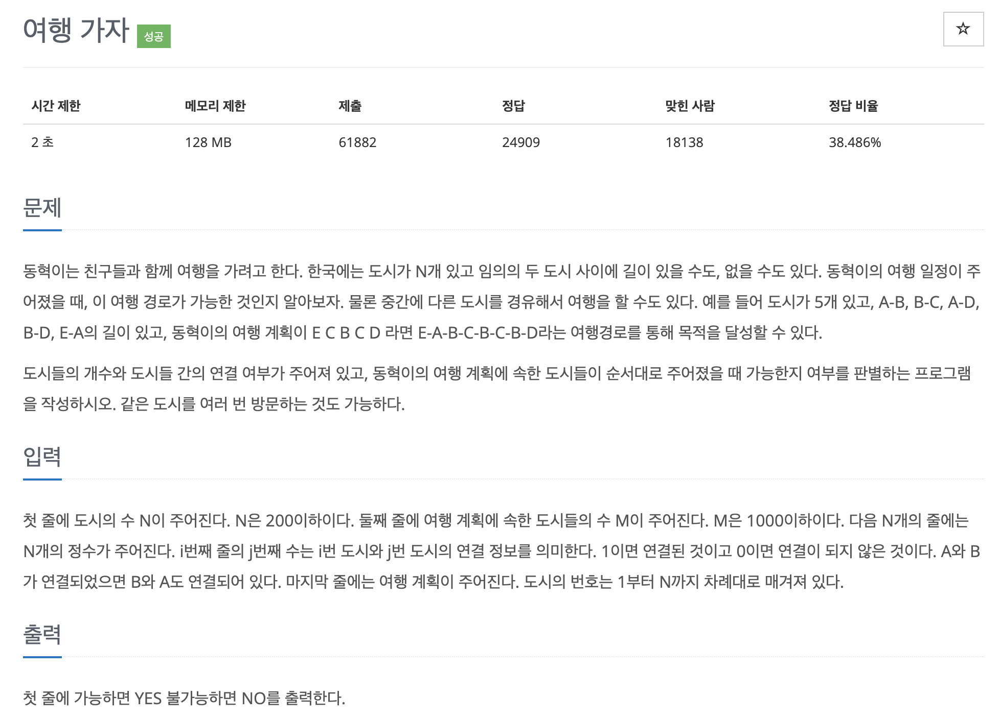

# 문제 054. 여행 계획 짜기



### 내가 작성한 풀이 (오답)

```java
오답 코드 → 한 번 틀려서 수정한 건데 또 틀린다.. 어떻게 해야 할 지 모르겠다ㅜ

public class P1976_여행계획짜기 {

	static int[] parentNode;

	public static void main(String[] args) throws IOException {
		BufferedReader br = new BufferedReader(new InputStreamReader(System.in));
		StringTokenizer st;

		int N = Integer.parseInt(br.readLine());	// 도시의 수
		int M = Integer.parseInt(br.readLine());	// 여행 계획에 속한 도시들의 수

		// 부모 요소를 관리하는 배열 (자기 자신으로 초기화)
		parentNode = new int [N+1];
		for(int i=1; i<=N; i++) {
			parentNode[i] = i;
		}

		// 연결
		for(int i=1; i<=N; i++) {
			st = new StringTokenizer(br.readLine());

			for(int j=1; j<=N; j++) {
				int isConnect = Integer.parseInt(st.nextToken());	// 1은 연결된 것, 0은 연결되지 않은 것

				if(isConnect == 1) {
					union(i, j);
				}
			}
		}

		// 여행 계획에 속한 도시들이 순서대로 주어졌을 때 가능한지 여부 파악
		boolean stop = false;
		st = new StringTokenizer(br.readLine());
		int now = Integer.parseInt(st.nextToken());

		for(int i=1; i<M; i++) {
			int next = Integer.parseInt(st.nextToken());

			if(parentNode[now] != parentNode[next]) {
				stop = true;
				System.out.println("NO");
				break;
			}
		}

		if(!stop) {
			System.out.println("YES");
		}
	}

	/**
	 * a, b 도시를 연결
	 */
	private static void union(int a, int b) {
		int parentA = find(a);
		int parentB = find(b);

		if(parentA != parentB) {
			int min = Math.min(parentA, parentB);
			int max = Math.max(parentA, parentB);
			parentNode[max] = min;
		}
	}

	/**
	 * 부모 요소 찾기
	 */
	private static int find(int num) {
		if(parentNode[num] == num) {
			return num;
		}

		return find(parentNode[num]);
	}
}
```

### 문제집 풀이

```java
메모리 53796KB, 시간 456ms

public class P1976_여행계획짜기 {

	static int[] parent;

	public static void main(String[] args) {
		Scanner sc = new Scanner(System.in);
		int N = sc.nextInt();
		int M = sc.nextInt();

		int[][] dosi = new int [N+1][N+1];
		for(int i=1; i<=N; i++) {		// 도시 연결 데이터 저장하기
			for(int j=1; j<=N; j++) {
				dosi[i][j] = sc.nextInt();
			}
		}

		int[] route = new int [M+1];
		for(int i=1; i<=M; i++) {		// 여행 도시 정보 저장하기
			route[i] = sc.nextInt();
		}

		parent = new int [N+1];
		for(int i=1; i<=N; i++) {		// 대표 노드를 자기 자신으로 초기화하기
			parent[i] = i;
		}

		for(int i=1; i<=N; i++) {		// 인접 행렬에서 도시가 연결돼 있으면 union 실행하기
			for(int j=1; j<=N; j++) {
				if(dosi[i][j] == 1) {
					union(i, j);
				}
			}
		}

		// 여행 계획 도시들이 1개의 대표 도시로 연결돼 있는지 확인하기
		int index = find(route[1]);
		for(int i=2; i<route.length; i++) {
			if(index != find(route[i])) {
				System.out.println("NO");
				return;
			}
		}

		System.out.println("YES");
	}

	/**
	 * union 연산 : 대표 노드끼리 연결하기
	 */
	private static void union(int a, int b) {
		a = find(a);
		b = find(b);

		if(a != b) {
			parent[b] = a;
		}
	}

	/**
	 * find 연산
	 */
	private static int find(int a) {
		if(a == parent[a]) {
			return a;
		}

		return parent[a] = find(parent[a]);
	}
}
```

- 내 코드랑 비교해보면.. 난 입력받은 정보를 변수에 따로 저장하지 않고 바로바로 사용하려고 했다. 하지만 이렇게 작성하니 문제가 발생했을 때 원인을 파악하기가 너무 어렵다.  
   바로바로 사용하는 게 더 효율적이라고 생각했는데 유지보수 관점에서 보면 좀 번거롭더라도 변수에 저장하여 의미를 명확히 하고 사용하는 것이 더 좋을 것 같다.
