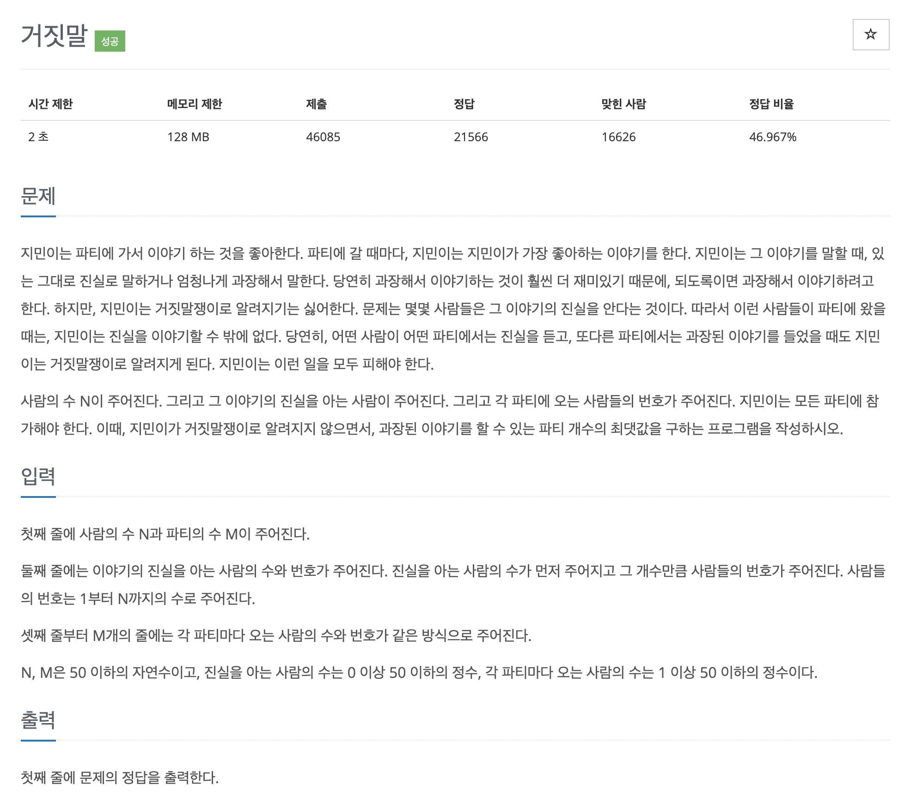

# 문제 055. 거짓말쟁이가 되긴 싫어



### 문제 분석

- 파티에 참석한 사람들을 1개의 집합으로 생각하고, 각각의 파티마다 union 연산을 이용해 사람들을 연결
- 위의 작업을 통해 1개의 파티에 참여한 모든 사람들은 같은 대표 노드를 바라보게 된다.
- 이후 각 파티의 대표 노드와 진실을 알고 있는 사람들의 각 대표 노드가 동일한지 find 연산을 이용해 확인

### 문제집 풀이

```java
메모리 17976KB, 시간 184ms

public class P1043_거짓말 {

	static int[] parent;
	static int[] trueP;
	static ArrayList<Integer>[] party;
	static int result;

	public static void main(String[] args) {
		Scanner sc = new Scanner(System.in);
		int N = sc.nextInt();
		int M = sc.nextInt();

		int T = sc.nextInt();
		result = 0;
		trueP = new int [T];
		for(int i=0; i<T; i++) {
			trueP[i] = sc.nextInt();
		}

		party = new ArrayList[M];
		for(int i=0; i<M; i++) {	// 파티 데이터 저장하기
			party[i] = new ArrayList<Integer>();
			int party_size = sc.nextInt();
			for(int j=0; j<party_size; j++) {
				party[i].add(sc.nextInt());
			}
		}

		parent = new int [N+1];
		for(int i=0; i<=N; i++) {	// 대표 노드를 자기 자신으로 초기화하기
			parent[i] = i;
		}

		for(int i=0; i<M; i++) {	// 각 파티에 참여한 사람들을 1개의 그룹으로 만들기
			int firstPeople = party[i].get(0);
			for(int j=1; j<party[i].size(); j++) {
				union(firstPeople, party[i].get(j));
			}
		}

		// 각 파티의 대표 노드와 진실을 아는 사람들의 대표 노드가 같다면 과장할 수 없음
		for(int i=0; i<M; i++) {
			boolean isPossible = true;
			int cur = party[i].get(0);
			for(int j=0; j<trueP.length; j++) {
				if(find(cur) == find(trueP[j])) {
					isPossible = false;
					break;
				}
			}

			if(isPossible) {
				result++;		// 모두 다르면 결괏값 1 증가
			}
		}

		System.out.println(result);
	}

	// union 연산
	private static void union(int a, Integer b) {
		a = find(a);
		b = find(b);

		if(a != b) {
			parent[b] = a;
		}
	}

	// find 연산
	private static int find(int a) {
		if(a == parent[a]) {
			return a;
		}

		return parent[a] = find(parent[a]);
	}
}
```
